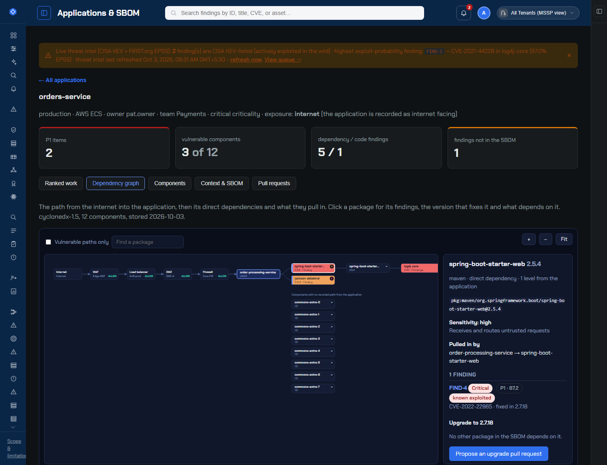
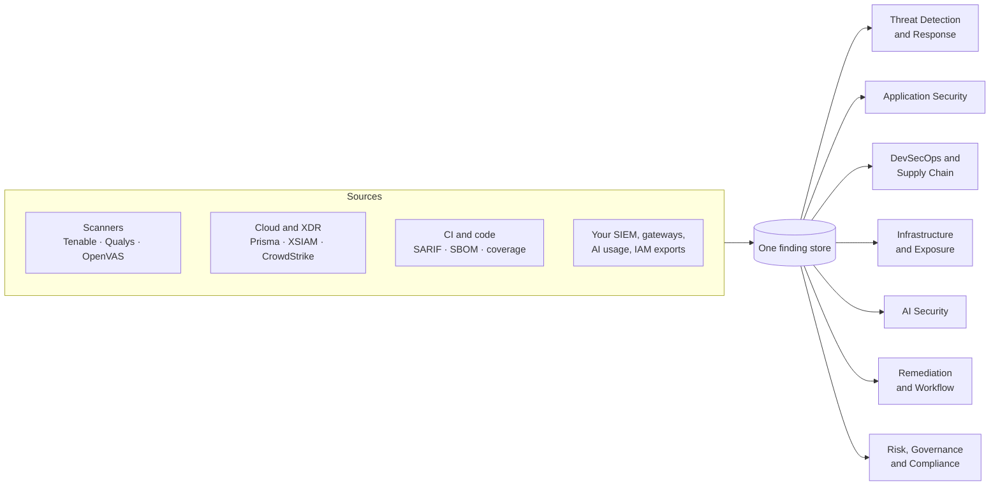
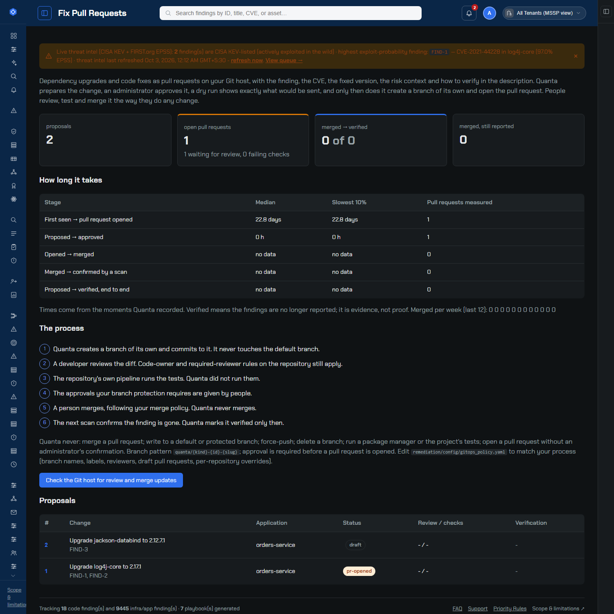
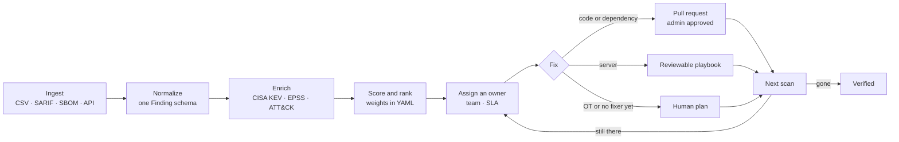
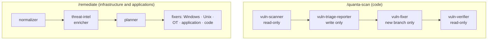
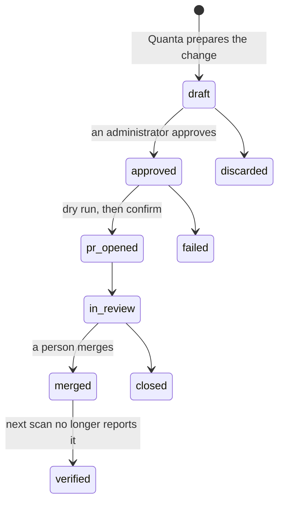

<div align="center">

# Quanta

**Find it. Rank it. Fix it. Prove it's gone.**

A self-hosted security operations platform that turns scanner noise into a ranked, owned, fix-ready queue,
and drafts the fix as a pull request or a reviewable playbook that a person approves. Nothing it generates ever runs on its own.

[](https://github.com/pavankumar-evani/VulnHunter/actions/workflows/ci.yml)


[](LICENSE)

[Quick start](#-quick-start) · [Pick your path](#-pick-your-path) · [What's inside](#-whats-inside) · [How it works](#-how-it-works) · [Safety model](#-the-safety-model) · [Docs](#-documentation-map)



<sub>The dependency and exposure graph, on the bundled demo data (fictional application). Click a package for its findings, the version that fixes it, and what depends on it.</sub>

</div>

---

## 🧭 Pick your path

Not sure where to start? Find the sentence that sounds like you.

| I want to… | Go here | Time |
|---|---|---|
| **See the product running** with data already in it | [Quick start](#-quick-start), then [load the application-security demo](#see-the-application-security-features) | 5 min |
| **Scan a codebase** and get a report plus safe auto-fixes | [`/quanta-scan`](#scan-a-codebase-quanta-scan) | 2 min |
| **Turn scanner exports into a ranked remediation plan** | [`/remediate`](#remediate-infrastructure-findings-remediate) | 5 min |
| **Connect a real scanner** (Tenable, Qualys, OpenVAS, …) | [docs/CONNECTOR_ONBOARDING.md](docs/CONNECTOR_ONBOARDING.md), [docs/GOING_LIVE.md](docs/GOING_LIVE.md) | 30 min |
| **Push SBOMs, SARIF or CI results from a pipeline** | [docs/INTEGRATION_API.md](docs/INTEGRATION_API.md) | 15 min |
| **Deploy it for a team** (Docker, PostgreSQL, TLS, Kubernetes) | [Deploying](#-deploying-it), [docs/PRODUCTION_GUIDE.md](docs/PRODUCTION_GUIDE.md) | 1 hr |
| **Evaluate it** (architecture, RBAC, pricing, POC) | [Enterprise documentation suite](docs/enterprise-suite/hub.html) | 20 min |
| **Contribute or hand over** to another developer | [CLAUDE.md](CLAUDE.md), [BRANCHES.md](BRANCHES.md), [KNOWLEDGE_TRANSFER.md](KNOWLEDGE_TRANSFER.md) | 15 min |

---

## ⚡ Quick start

You need Python 3.12 (what CI runs) and `git`. No Node.js, no build step.

```bash
git clone https://github.com/pavankumar-evani/VulnHunter.git
cd VulnHunter
pip install -r dashboard/requirements.txt
python dashboard/app.py
```

Open **https://127.0.0.1:5050**. The first run creates a self-signed certificate, so your browser warns once; that is expected.
Sign in with the demo admin `admin@quanta.local` / `ChangeMe123!` (public demo credentials; change them before real use).

> [!NOTE]
> The repository ships with sample findings, so the dashboard is not empty on first run. Press **Ctrl/Cmd + K** anywhere for instant navigation, and open **All modules** to browse what the product does by goal.

### See the application-security features

```bash
python cli/quanta_admin.py seed-appsec-demo           # one demo application, its SBOM and a few findings
python cli/quanta_admin.py seed-appsec-demo --remove  # undo exactly that, nothing else
```

Then open **Applications** (`/applications`) for the ranked work and the graph, **Fix Pull Requests** (`/fix-prs`), **Pipeline Gates** (`/pipeline-gates`) and **Secure Design** (`/secure-design`).
The command also prints the `network_topology.yaml` entry that makes the graph show an internet-to-application path.

<details>
<summary><b>Run the pipelines inside Claude Code instead</b> (needs the Claude Code CLI)</summary>

```bash
claude
/quanta-scan vulnerable-demo-app            # scan and report
/quanta-scan vulnerable-demo-app --fix      # also fix the safe findings on a new branch
/remediate                                  # ingest the bundled scanner exports, plan
/remediate --generate                       # also draft playbooks for the auto-remediable findings
```

Headless (CI, cron, the dashboard's own Run page): `python cli/quanta.py --dry-run scan vulnerable-demo-app --fix`. Dry run is the default and spends nothing. See [cli/README.md](cli/README.md).

</details>

---

## 🧩 What's inside

Quanta is organised into **eight modules**. The sidebar shows one at a time, and the module is also the unit of [licensing](docs/LICENSING.md). Expand any module.



<details>
<summary><b>1 · Threat Detection &amp; Response</b>: triage, hunt, detect, respond</summary>

- **SOC operations**: ITIL cases in L1/L2/L3 queues, priority from impact × urgency, service-level clocks, escalation that needs a written hand-off, MTTA/MTTR and SLA metrics.
- **Alert triage and L1 investigation**: alerts ranked with vulnerability context, a weighted-signal verdict (never a false positive for a Critical alert), optional read-only SIEM evidence.
- **Threat hunting**: a hunt per known-exploited CVE in your estate, with the ATT&CK techniques and queries to run in *your* SIEM.
- **Detection engineering**: per-rule true-positive and noise rates, health tiers, Sigma drafts, ATT&CK coverage.
- **SOAR**: validated playbooks; anything that changes your environment needs a second person's approval; responses are signed webhooks to endpoints you own.
- **Threat intelligence and Dark Web Watch**: STIX and text intake, leak-site and credential-exposure matching.

Details: [SOC reference](docs/enterprise-suite/soc-operations.html).
</details>

<details>
<summary><b>2 · Application Security</b>: APIs, threat models, code</summary>

- **API security**: inventory from OpenAPI files and gateway logs, shadow and deprecated endpoints, OWASP API Top 10 findings with an evidence chain, caller activity, data sensitivity from *your* classification, protection policies sent as signed requests (Quanta changes no WAF). See [docs/API_SECURITY.md](docs/API_SECURITY.md).
- **Threat models**: components, data flows and trust zones; STRIDE threats raised by explicit rules and joined to live findings.
- **Code scan**: the `/quanta-scan` pipeline's results.
</details>

<details>
<summary><b>3 · DevSecOps &amp; Supply Chain</b>: SBOMs, the graph, fix pull requests, the release gate</summary>

- **Applications and SBOMs**: CycloneDX and SPDX in, or generated from `requirements.txt`, `package.json`, a lock file, `pom.xml` or `go.mod`. Only a lock file gives transitive dependencies, and Quanta says so.
- **Ranked work**: every finding scored with a visible breakdown (CVSS, EPSS, known-exploited, application criticality, package sensitivity, attack surface, network path). Findings that share one upgrade are grouped into it.
- **Interactive dependency and exposure graph**: plain SVG, pan and zoom, paths from the internet to the vulnerable package.
- **Fix pull requests** (GitHub and GitLab): deterministic manifest edits, an evidence-carrying description, admin approval, a dry run first, then a new branch and a pull request. See [the lifecycle](#fix-pull-request-lifecycle).
- **CI release gate**: `GET /api/gate/evaluate` returns pass, warn or fail with reasons; every evaluation is recorded and counts as evidence for a control.
- **Secure design assistant** and **your own controls**: a short questionnaire becomes requirements, ASVS references, pipeline controls and STRIDE questions; add organisation-specific controls that use the same evidence model.


</details>

<details>
<summary><b>4 · Infrastructure &amp; Exposure</b>: scanners, assets, firewalls, attack paths</summary>

- Scanner and asset-source connectors, an **asset inventory** with owners, **firewall rule analysis** (FW001–FW013, access requests checked against the rules), **attack paths** from ATT&CK tactics, **dependency blast radius**, **zero-day watch** (new CISA KEV entries matched to your vendors), and quantum readiness.
- Compensating-control coverage and network reachability are shown on every finding; with nothing recorded they say *unknown*, never a guess.
</details>

<details>
<summary><b>5 · AI Security</b></summary>

- A register of AI systems checked against the **OWASP LLM Top 10 (2025)**, MCP exposure and governance (an unanswered question is a gap, not a pass), **AI usage analytics** from provider usage APIs and OTLP (cost is reported, estimated or unknown, never zero), and discovery of unreviewed AI applications from proxy or DNS exports.
</details>

<details>
<summary><b>6 · Remediation &amp; Workflow</b>: plans, approvals, tickets</summary>

- A live, re-scored **remediation queue** with SLA clocks, KEV and EPSS-aware priority, **risk tiers** (auto-approvable, needs change approval, manual only) and rollout rings.
- **Approvals** with an Active Directory group check, **exceptions** (time-boxed risk acceptance that expires), **assignments** to people and teams, **ServiceNow and Jira** push with state mapped back, and **closed-loop verification** from the next scan.
</details>

<details>
<summary><b>7 · Risk, Governance &amp; Compliance</b></summary>

- **GRC**: framework catalogs (NIST 800-53, CSF 2.0, an AI-governance set, or a full OSCAL catalog), a risk register, automated control tests (too little data gives *n/a*, never a pass), attestations and versioned policies.
- **Cyber risk**: FAIR-style Monte Carlo (ALE, P90/P95, treatment ROI) and a cyber health score. Inputs are your estimates.
- **Access governance** (leavers, dormant, separation of duties, manager reviews), **reports** and the activity log.
- Quanta supplies evidence and workflow. It does not certify compliance.
</details>

<details>
<summary><b>8 · Administration</b> (always included)</summary>

- Sign-in, teams, connections with encrypted credentials, API keys with scopes, support tickets with SLAs, search, notifications, and the licence.
</details>

<details>
<summary><b>Connectors</b>: what Quanta can read from and write to</summary>

| Direction | Systems |
|---|---|
| Pull (findings and assets) | Tenable, Qualys, OpenVAS/GVM, Prisma Cloud, Cortex XSIAM, Infoblox, Axonius, Active Directory, Armis, CrowdStrike |
| Pull (supply chain and intel) | OSV, GitHub, GitLab, VirusTotal, Splunk search (read-only), dark-web feeds, Anthropic and OpenAI usage |
| Push | ServiceNow, Jira, Splunk, signed webhooks to endpoints you own |
| Inbound API (keys with scopes) | findings, scanner CSV, SARIF, coverage, SBOM, alerts (incl. OCSF), threat intel, controls, AI usage, API test results, ticket and pull-request status, `GET /api/gate/evaluate` |

Each is built against the vendor's public API and unit-tested against a hand-rolled fake. See [honest limits](#-honest-limits).
</details>

---

## 🔧 How it works

### The path every finding takes



Scoring and thresholds are deterministic and live in YAML under `remediation/config/`; an administrator edits them in the app and the queue re-scores immediately.
The language model is used only where judgment is needed (classifying odd rows, drafting a playbook or a code diff), and a deterministic layer validates what it returns.

### The two Claude Code pipelines



Twelve subagents in all, each with a **deliberately narrow tool list** (the scanner cannot write; the fixers can only read and write files and have no shell). That scoping is the safety boundary, not a convenience.

### Fix pull request lifecycle



The pull request is the **only** place Quanta writes to a repository: always a new branch, never the default or a protected branch, never merged by Quanta. State comes back by a signed webhook, an hourly follow-up, or a manual check.

---

## 🛡 The safety model

> [!IMPORTANT]
> **Nothing Quanta generates runs on its own.** Everything below is enforced in code and covered by tests, not just promised in a document.

- **Generate, never execute.** Fixers write playbooks, plans or diffs for people (or your own approved automation) to run.
- **Dry run by default**, with an explicit confirm and an administrator login for every action that spends money or touches another system.
- **Pull requests**: new branch only, approval first, denied paths (pipeline files, CODEOWNERS, keys), no force-push, no merge, no package manager, no test run.
- **Honest data**: KEV and EPSS apply only to findings with a CVE; an unmeasured domain is listed, not counted; "unknown" is shown instead of a guess; verification is evidence from the next scan, not proof.
- **Credentials** are encrypted at rest, passed as constructor arguments, and never put in an error message.

> [!WARNING]
> `vulnerable-demo-app/` is intentionally insecure and exists only to be scanned. Never deploy it anywhere reachable.

---

## 🎬 Try the two original demos

### Scan a codebase (`/quanta-scan`)

A deliberately vulnerable Flask app in `vulnerable-demo-app/` carries planted flaws (SQL injection, command injection, `eval()`, a hardcoded key, plaintext passwords, debug mode, a root container with a baked-in secret) plus AI/ML and API-authorization fixtures: 18 in total.

```bash
claude
/quanta-scan vulnerable-demo-app --fix
```

Expected: the findings in seconds, the mechanical ones fixed on a pushed branch, and the rest left for a human with a reason each (for example, removing `eval()` from `/calc` needs a redesign).

### Remediate infrastructure findings (`/remediate`)

```bash
/remediate --generate
```

Expected on the bundled sample exports: 15 findings across 7 asset classes, enriched with real KEV and EPSS data, planned by risk tier, with Ansible playbooks for the Windows and Unix findings and an explicit reason for the classes that have no fixer yet.
`remediation/sample-data/generate_bulk_findings.py` can expand this to roughly 8,000 findings built from real CVEs for scale testing.

---

## 🚀 Deploying it

| Option | What you get | Start with |
|---|---|---|
| **Local** | SQLite, self-signed TLS | the [Quick start](#-quick-start) |
| **Docker Compose** | the app, PostgreSQL and a Caddy TLS front | `docker-compose.yml`, `.env.production.example` |
| **Kubernetes (Helm)** | several replicas, leader-elected scheduler, a durable job queue, secrets from a vault | [docs/KUBERNETES.md](docs/KUBERNETES.md), `deploy/helm/quanta` |

Before real use: set `QUANTA_PRODUCTION=true` (refuses demo passwords and a missing session secret, and closes anonymous reads), a stable `QUANTA_SESSION_SECRET`, and `QUANTA_ENCRYPTION_KEY`. The operator tool is `python cli/quanta_admin.py` (`gen-key`, `init`, `bootstrap`, `create-admin`, `check`, `backup`, `restore`, `rotate-keys`, `migrate`).
Full checklist: [docs/PRODUCTION_GUIDE.md](docs/PRODUCTION_GUIDE.md). Module licences are signed, verified offline, and start in a non-blocking `warn` mode: [docs/LICENSING.md](docs/LICENSING.md).

---

## ⚠️ Honest limits

Quanta would rather say what it has not done than imply it.

| Status | What |
|---|---|
| ✅ Built and covered by tests | Ingest, scoring, the queue, approvals, exceptions, SBOM and graph, the pull-request lifecycle, the release gate, GRC, SOC cases, firewall analysis, licensing |
| ⚠️ Unit-tested against fakes, **not run against a live vendor account** | Every connector, the Git host integration, OSV, signed webhooks, SIEM search, policy pushes |
| ⚠️ Needs the Claude Code CLI | The AI fixers and the two slash commands |
| ❌ Not done | Regenerating lock files or running a project's tests; shipping an advisory database (vulnerabilities come from scanner findings or the OSV check); acting on a firewall, WAF or SIEM; deep-learning models (the SOC models are classical statistics and Naive Bayes); a multi-machine file-lock story beyond the database leases |
| ℹ️ Scale | Findings are one stored file: tens of thousands, not millions. The Helm chart passes `helm lint` and `template` but has not been installed on a live cluster. |

---

## 📚 Documentation map

| If you need… | Read |
|---|---|
| The 5-minute path | [docs/GETTING_STARTED.md](docs/GETTING_STARTED.md) |
| Day-to-day how-to | [docs/USER_GUIDE.md](docs/USER_GUIDE.md), [docs/FAQ.md](docs/FAQ.md) |
| Every page, connector, schema and role in depth | [docs/enterprise-suite/hub.html](docs/enterprise-suite/hub.html) (16 documents) |
| The integration API | [docs/INTEGRATION_API.md](docs/INTEGRATION_API.md) |
| Going live | [docs/GOING_LIVE.md](docs/GOING_LIVE.md), [docs/PRODUCTION_GUIDE.md](docs/PRODUCTION_GUIDE.md), [docs/KUBERNETES.md](docs/KUBERNETES.md) |
| Architecture and design rationale | [KNOWLEDGE_TRANSFER.md](KNOWLEDGE_TRANSFER.md), [dashboard/README.md](dashboard/README.md) |
| Pricing, licensing, comparison | [docs/PRICING.md](docs/PRICING.md), [docs/LICENSING.md](docs/LICENSING.md), [docs/VR_PLATFORM_COMPARISON.md](docs/VR_PLATFORM_COMPARISON.md) |
| What changed | [CHANGELOG.md](CHANGELOG.md) |
| Reporting a security issue | [SECURITY.md](SECURITY.md) |

<details>
<summary><b>Repository layout</b></summary>

```text
.claude/agents/        12 scoped subagents (scanner, reporter, fixers, normalizer, enricher, planner, verifier)
.claude/commands/      /quanta-scan and /remediate
cli/                   quanta.py (headless pipelines), quanta_admin.py (operator), quanta_license.py
dashboard/             FastAPI backend (app.py, appsec_api.py) and the vanilla-JS single-page app (static/)
remediation/           the engine: ingest, enrichment, scoring, appsec, gitops, devsecops, soc, soar, hunting,
                       risk, grc, iam, firewall, aisec, aiusage, apisec, connectors, connections, licensing, config/
tests/                 one unittest file per module; hand-rolled fakes, no real spend
docs/                  guides, the integration API, and docs/enterprise-suite/ (16 HTML documents)
deploy/, Dockerfile    Helm chart, Caddy, container build
scripts/               migrations, end-to-end replica test, the PDF/offline documentation pipeline
vulnerable-demo-app/   the intentionally vulnerable scan target (never deploy)
```
</details>

## 🧪 Tests and contributing

```bash
python -m unittest discover -s tests -p "test_*.py"    # 2,475 tests, takes about ten to twenty minutes
```

One `unittest` file per module, hand-rolled fakes, and no real spend in the suite. CI installs the four requirements files and runs it on every push and pull request.
Several sessions can work in parallel: [BRANCHES.md](BRANCHES.md) says which branch owns which folder, and [CLAUDE.md](CLAUDE.md) is the working guide for anyone (human or Claude Code) changing the code. Keep the [enterprise documentation suite](docs/enterprise-suite/MANIFEST.md) in step with any change that makes a claim in it wrong.

## Disclaimer

The sample data is fictional: hostnames, IP addresses and device names are made up, and the CVE IDs are real public ones used only to make the guidance realistic. No exploit code is included.
Generated playbooks in `remediation/output/` are unreviewed drafts and must never run against real infrastructure without human review and, where flagged, formal change approval.

<div align="center"><sub>© 2026 Quanta. All rights reserved. Proprietary and confidential; see <a href="LICENSE">LICENSE</a>.</sub></div>
