<div align="center">

# Quanta

**Find it. Rank it. Fix it. Prove it's gone.**

A self-hosted security operations platform that turns scanner noise into a ranked, owned, fix-ready queue, and drafts the fix as a pull request or a reviewable playbook that a person approves. Nothing it generates ever runs on its own.

[](https://github.com/pavankumar-evani/VulnHunter/actions/workflows/ci.yml)


[](LICENSE)

[About](#-about) · [Quick start](#-quick-start) · [Pick your path](#-pick-your-path) · [Modules](#-the-eight-modules) · [How it works](#-how-it-works) · [Safety](#-the-safety-model) · [Compared with other tools](#-how-quanta-compares) · [Docs](#-documentation-map)

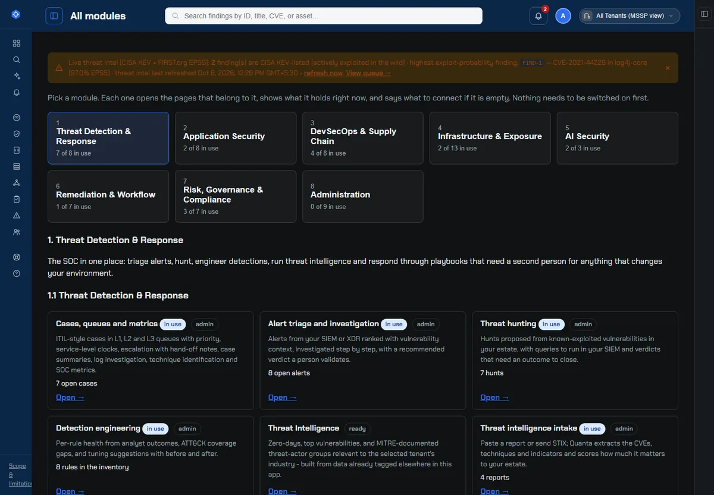

<sub>The All modules page: pick one of the eight modules and the application shows only that module, with live counts and what to connect when it is empty.</sub>

</div>

---

## 📖 About

**Quanta is a self-hosted security operations platform built around one idea: finding a vulnerability and fixing it are two different jobs, and most tools only do the first.**

Security teams already own scanners, a SIEM, a ticketing system and a compliance spreadsheet. What they lack is the layer between them: one place where every finding is normalised, ranked by real-world risk, given an owner, turned into a fix someone can review, and checked again after the fix. Quanta is that layer. It reads from the tools you have, keeps one store of findings, and drives the work to a verified close.

It is built on five principles, and each is enforced in code and covered by tests rather than only promised in a document:

1. **One finding store.** Code, dependencies, servers, network gear, OT, certificates, APIs, AI systems and SOC alerts all land in the same schema, so a single ranked queue and a single set of owners cover everything.
2. **Deterministic and explainable.** Scoring weights and thresholds live in YAML an administrator edits in the app, and every score shows its breakdown. A language model is used only where judgment is needed (classifying an odd row, drafting a playbook or a diff), and a deterministic layer validates what it returns.
3. **Humans hold the gates.** Dry run by default, an explicit confirm and an administrator for anything that spends money or touches another system, a second person for anything that changes an environment. Quanta never merges a pull request and never runs a generated playbook.
4. **Evidence over assertion.** "Verified" means the next scan no longer reports the finding. A control with no data is *n/a*, not a pass. A domain nobody measured is listed, not counted. Unknown is shown as unknown.
5. **Yours to run.** Self-hosted, offline-verifiable licensing, no telemetry, credentials encrypted at rest, deployable from a laptop to Kubernetes.

**Who it is for:** security and vulnerability-management teams, AppSec and DevSecOps engineers, SOC analysts and engineers, and the GRC and risk owners who need evidence. **What it is not:** a scanner, a SIEM, an EDR agent, a firewall or WAF, or a compliance certifier. It works with those, and [says plainly where it stops](#-honest-limits).

---

## 🆕 What's new

- **SOC incidents, not cases to create.** Every investigated alert is grouped into an incident (shared host, account or indicator, bursts, shared vulnerabilities, kill-chain progression), summarised and routed to an analyst or tier with the reason stored. [docs/SOC_INCIDENTS.md](docs/SOC_INCIDENTS.md)
- **Investigation reports and hunt reports**, assembled from stored data with every statement tied to evidence, and a **proactive hunt engine** that suggests hypotheses and says "cannot tell" instead of guessing. [docs/INVESTIGATION_REPORTS.md](docs/INVESTIGATION_REPORTS.md), [docs/HUNT_ENGINE.md](docs/HUNT_ENGINE.md)
- **Typed decisions and a confidence gate** with a calibration report: the decision layer decides when a person must look. [docs/DECISIONS.md](docs/DECISIONS.md)
- **External attack surface** from the output of the discovery tools you run (Quanta never scans), and the **Anthropic CVD feed** as a threat-intelligence source. [docs/ATTACK_SURFACE.md](docs/ATTACK_SURFACE.md), [docs/CVD_FEED.md](docs/CVD_FEED.md)
- **A read-only MCP endpoint** so an AI assistant can query Quanta safely (off by default, key-only, team-scoped). [docs/MCP_ENDPOINT.md](docs/MCP_ENDPOINT.md)
- **Insights on Home** (17 deterministic detectors, "not enough history" instead of guessing) and **structured Ask**. [docs/INSIGHTS.md](docs/INSIGHTS.md)
- **Security Posture Review**, **relationship graphs for every module** and an **ontology** with provenance. [docs/POSTURE.md](docs/POSTURE.md), [docs/ONTOLOGY.md](docs/ONTOLOGY.md)
- **Integrity checks and safe self-heal**, **environments and a release process**, and **simulated connectors** that replay vendor-format responses through the real connector code. [docs/INTEGRITY.md](docs/INTEGRITY.md), [docs/ENVIRONMENTS.md](docs/ENVIRONMENTS.md), [docs/RELEASE_PROCESS.md](docs/RELEASE_PROCESS.md), [docs/SIMULATION.md](docs/SIMULATION.md)
- **A new UI kit**: a command palette (Ctrl/Cmd+K), live updates and a rebuilt SOC and Hunting experience. [docs/UI_KIT.md](docs/UI_KIT.md), [docs/SOC_HUNT_UI.md](docs/SOC_HUNT_UI.md)
- **Reviewing the repository?** [docs/REVIEWER_GUIDE.md](docs/REVIEWER_GUIDE.md) says where things are, which command proves which claim, and what has not been verified.

---

## 🧭 Pick your path

Not sure where to start? Find the sentence that sounds like you.

| I want to… | Go here | Time |
|---|---|---|
| **See the product running** with data already in it | [Quick start](#-quick-start), then [load the application-security demo](#see-the-application-security-features) | 5 min |
| **Scan a codebase** and get a report plus safe auto-fixes | [`/quanta-scan`](#scan-a-codebase-quanta-scan) | 2 min |
| **Turn scanner exports into a ranked remediation plan** | [`/remediate`](#remediate-infrastructure-findings-remediate) | 5 min |
| **Connect a real scanner** (Tenable, Qualys, OpenVAS, …) | [docs/CONNECTOR_ONBOARDING.md](docs/CONNECTOR_ONBOARDING.md), [docs/GOING_LIVE.md](docs/GOING_LIVE.md) | 30 min |
| **Push SBOMs, SARIF or CI results from a pipeline** | [docs/INTEGRATION_API.md](docs/INTEGRATION_API.md) | 15 min |
| **Deploy it for a team** (Docker, PostgreSQL, TLS, Kubernetes) | [Deploying](#-deploying-it), [docs/PRODUCTION_GUIDE.md](docs/PRODUCTION_GUIDE.md) | 1 hr |
| **Evaluate it** (architecture, RBAC, pricing, POC) | [Enterprise documentation suite](docs/enterprise-suite/hub.html) | 20 min |
| **Let an AI assistant query Quanta** (read-only MCP) | [docs/MCP_ENDPOINT.md](docs/MCP_ENDPOINT.md) | 10 min |
| **Review the repository** (person or model) | [docs/REVIEWER_GUIDE.md](docs/REVIEWER_GUIDE.md) | 15 min |
| **Contribute or hand over** to another developer | [CLAUDE.md](CLAUDE.md), [BRANCHES.md](BRANCHES.md), [KNOWLEDGE_TRANSFER.md](KNOWLEDGE_TRANSFER.md) | 15 min |

---

## ⚡ Quick start

You need Python 3.12 (what CI runs) and `git`. No Node.js, no build step.

```bash
git clone https://github.com/pavankumar-evani/VulnHunter.git
cd VulnHunter
pip install -r dashboard/requirements.txt
python dashboard/app.py
```

Open **https://127.0.0.1:5050**. The first run creates a self-signed certificate, so your browser warns once; that is expected.
Sign in with the demo admin `admin@quanta.local` / `ChangeMe123!` (public demo credentials; change them before real use).

> [!NOTE]
> The repository ships with sample findings, so the dashboard is not empty on first run. Press **Ctrl/Cmd + K** anywhere for instant navigation, and open **All modules** to browse what the product does by goal.

### See the application-security features

```bash
python cli/quanta_admin.py seed-appsec-demo           # one demo application, its SBOM and a few findings
python cli/quanta_admin.py seed-appsec-demo --remove  # undo exactly that, nothing else
```

Then open **Applications** (`/applications`) for the ranked work and the graph, **Fix Pull Requests** (`/fix-prs`), **Pipeline Gates** (`/pipeline-gates`) and **Secure Design** (`/secure-design`).
The command also prints the `network_topology.yaml` entry that makes the graph show an internet-to-application path.

<details>
<summary><b>Run the pipelines inside Claude Code instead</b> (needs the Claude Code CLI)</summary>

```bash
claude
/quanta-scan vulnerable-demo-app            # scan and report
/quanta-scan vulnerable-demo-app --fix      # also fix the safe findings on a new branch
/remediate                                  # ingest the bundled scanner exports, plan
/remediate --generate                       # also draft playbooks for the auto-remediable findings
```

Headless (CI, cron, the dashboard's own Run page): `python cli/quanta.py --dry-run scan vulnerable-demo-app --fix`. Dry run is the default and spends nothing. See [cli/README.md](cli/README.md).

</details>

---

## 🧩 The eight modules

Quanta is organised into **eight modules**. The sidebar shows one at a time, and the module is also the unit of [licensing](docs/LICENSING.md). Every page below is a real screenshot of the running application on its bundled demo data; select one to open it full size.

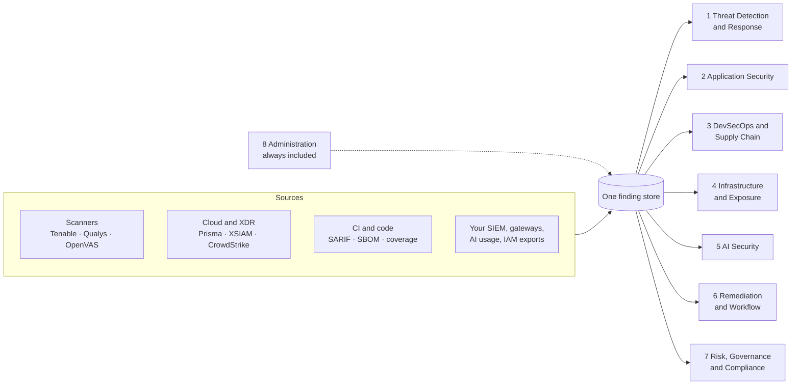
```mermaid
flowchart LR
    subgraph Sources
      S1[Scanners<br/>Tenable · Qualys · OpenVAS]
      S2[Cloud and XDR<br/>Prisma · XSIAM · CrowdStrike]
      S3[CI and code<br/>SARIF · SBOM · coverage]
      S4[Your SIEM, gateways,<br/>AI usage, IAM exports]
    end
    Sources --> F[(One finding store)]
    F --> M1[1 Threat Detection<br/>and Response]
    F --> M2[2 Application Security]
    F --> M3[3 DevSecOps and<br/>Supply Chain]
    F --> M4[4 Infrastructure<br/>and Exposure]
    F --> M5[5 AI Security]
    F --> M6[6 Remediation<br/>and Workflow]
    F --> M7[7 Risk, Governance<br/>and Compliance]
    M8[8 Administration<br/>always included] -.-> F
```

### Home

Every page opens from the **Home** block: the **Dashboard** (KPIs, SLA status, coverage), **All modules** (browse by goal; selecting a module opens it and the sidebar then shows only that module), **Insights** (what changed and why it matters, from 17 deterministic detectors; it says "not enough history" rather than guess) and **Ask Quanta** (a fixed-grammar structured question run with your own permissions, then free search over your live data: no AI call, and it never invents a number), **AI Assist** (explain a finding or draft guidance; the preview is free and you confirm to spend) and the **Inbox** (SLA breaches, new known-exploited CVEs, expiring exceptions). **Support** is a real helpdesk and **FAQ** answers the usual questions.

<table>
<tr><td valign="top" width="33%"><a href="docs/images/modules/home-dashboard.webp">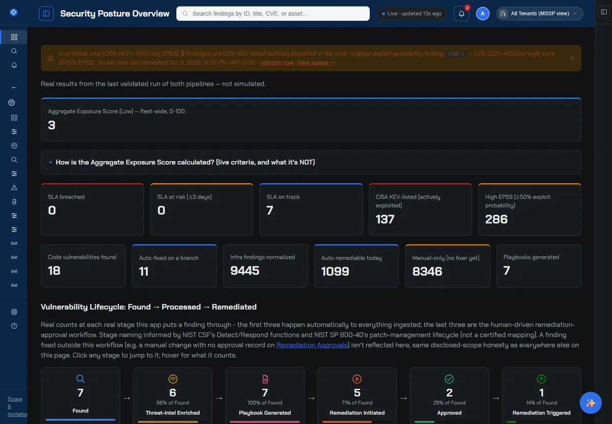</a><br><sub><b>Dashboard</b><br>KPIs, SLA status, and coverage across both pipelines at a glance</sub></td><td valign="top" width="33%"><a href="docs/images/modules/home-modules.webp"></a><br><sub><b>All modules</b><br>Pick what you want to do - vulnerability management, cyber risk, detection and hunting, the L1 SOC with SOAR, and more - and open the pages that belong to it</sub></td><td valign="top" width="33%"><a href="docs/images/modules/home-ask.webp">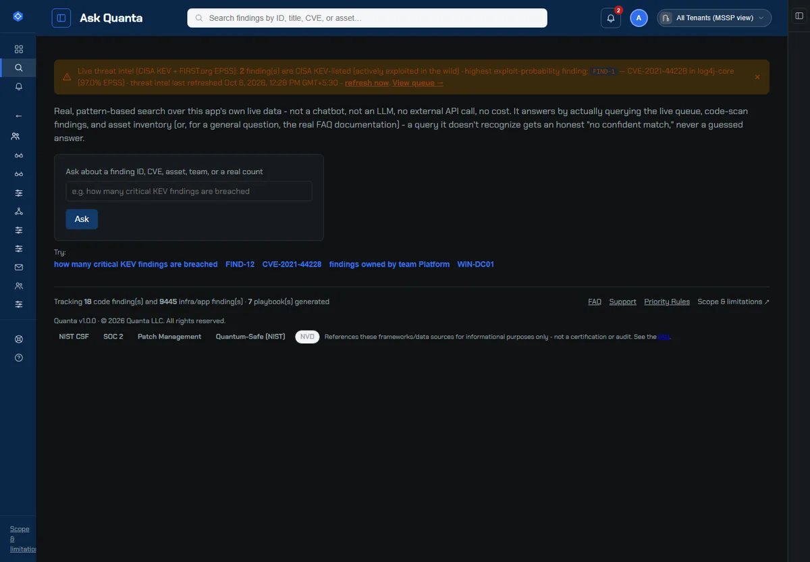</a><br><sub><b>Ask Quanta</b><br>Free, real search over your live data - findings, CVEs, assets, real counts</sub></td></tr>
</table>


### 1 · Threat Detection & Response

The SOC in one place: triage alerts, hunt, engineer detections, run threat intelligence, and respond through playbooks that need a second person for anything that changes your environment.

<table>
<tr><td valign="top" width="33%"><a href="docs/images/modules/soc-operations.webp">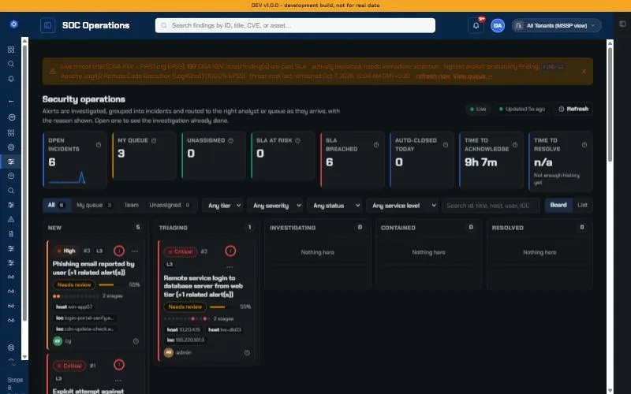</a><br><sub><b>SOC Operations</b><br>Admin: the SOC command center. Incidents arrive investigated, grouped and routed with the reason shown, on a live board with service-level rings, an auto-closed lane with undo and the analyst roster</sub></td><td valign="top" width="33%"><a href="docs/images/modules/soc-alert-triage.webp">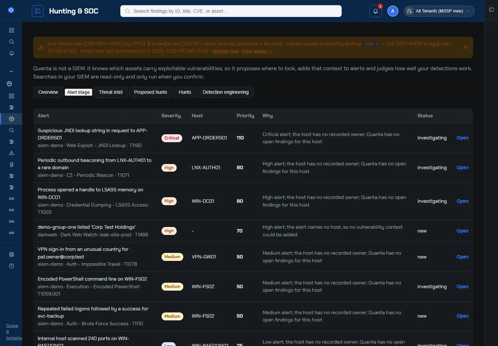</a><br><sub><b>Alert Triage</b><br>Alerts from your SIEM or XDR ranked with vulnerability context, investigated step by step, with a recommended verdict a person validates</sub></td><td valign="top" width="33%"><a href="docs/images/modules/soc-threat-hunting.webp">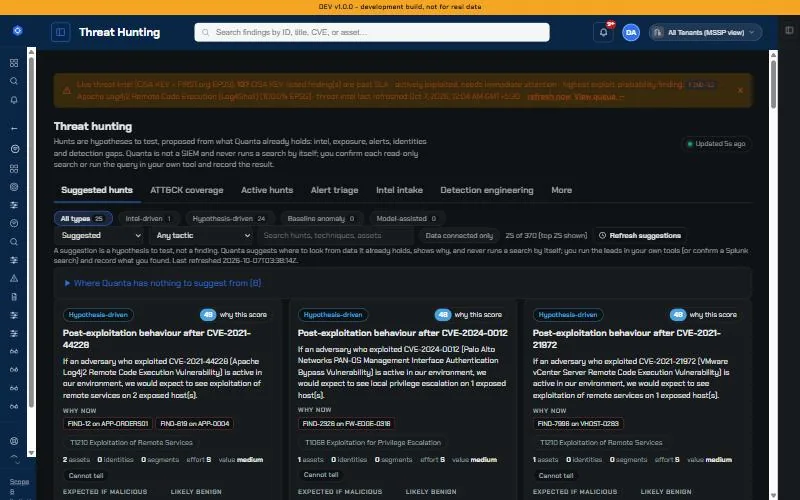</a><br><sub><b>Threat Hunting</b><br>A board of suggested hunts, each with why-now evidence, a score breakdown, SPL, Sigma and KQL queries, and accept, dismiss, conclude and promote actions</sub></td></tr>
<tr><td valign="top" width="33%"><a href="docs/images/modules/soc-detection-engineering.webp">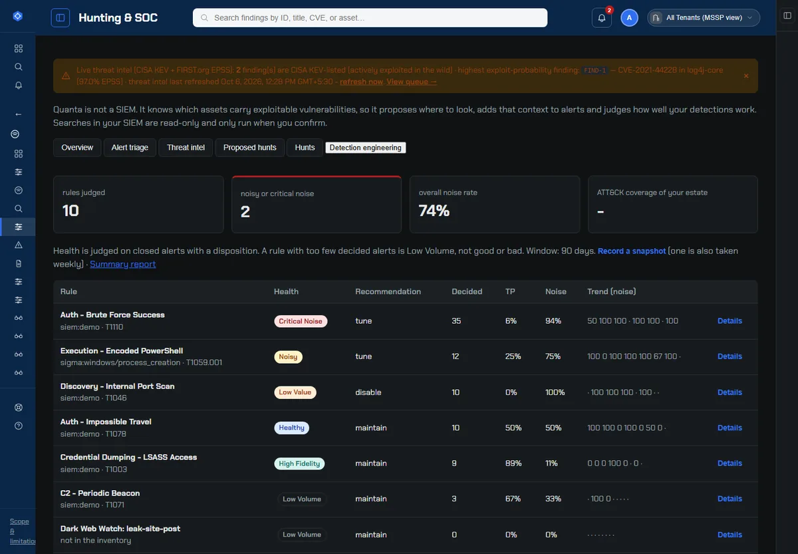</a><br><sub><b>Detection Engineering</b><br>Per-rule health from analyst outcomes, ATT&CK coverage gaps, and tuning suggestions with before and after</sub></td><td valign="top" width="33%"><a href="docs/images/modules/soc-threat-intel.webp">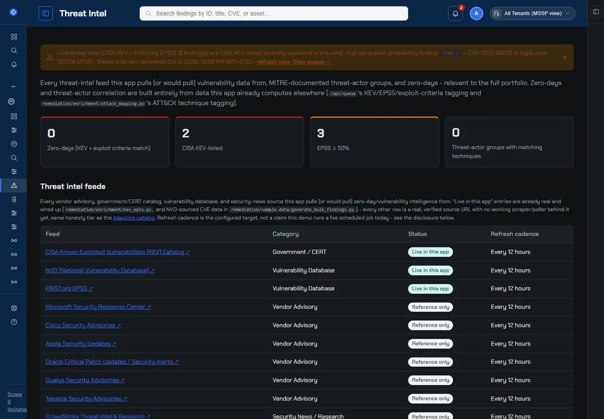</a><br><sub><b>Threat Intelligence</b><br>Zero-days, top vulnerabilities, and MITRE-documented threat-actor groups relevant to the selected tenant's industry - built from data already tagged elsewhere in this app</sub></td><td valign="top" width="33%"><a href="docs/images/modules/soc-intel-intake.webp">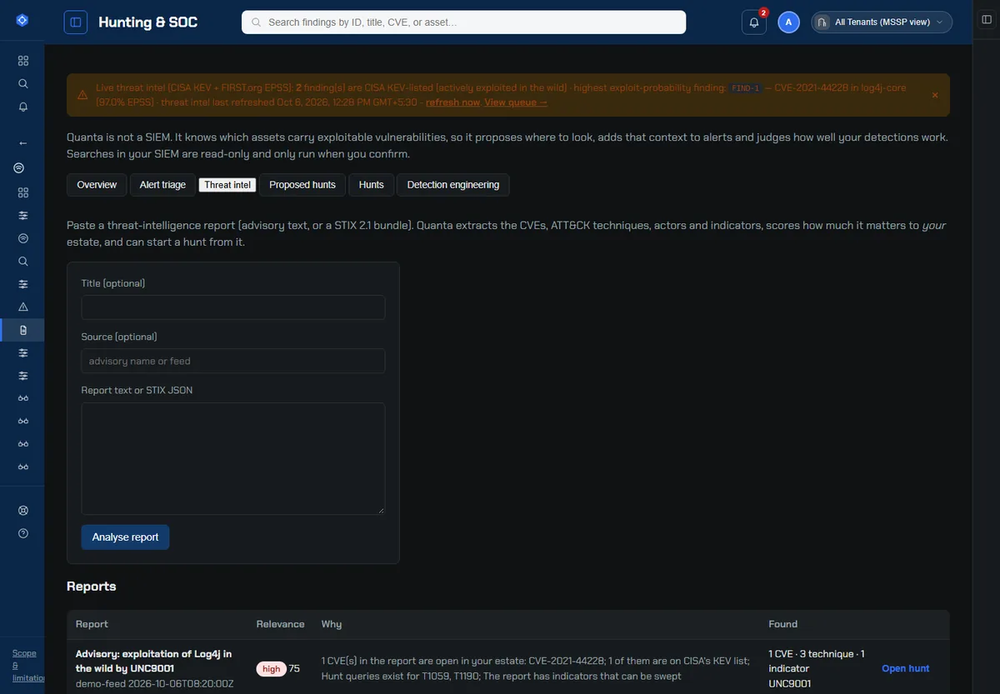</a><br><sub><b>Intel Intake</b><br>Paste a report or send STIX; Quanta extracts the CVEs, techniques and indicators and scores how much it matters to your estate</sub></td></tr>
<tr><td valign="top" width="33%"><a href="docs/images/modules/soc-dark-web.webp">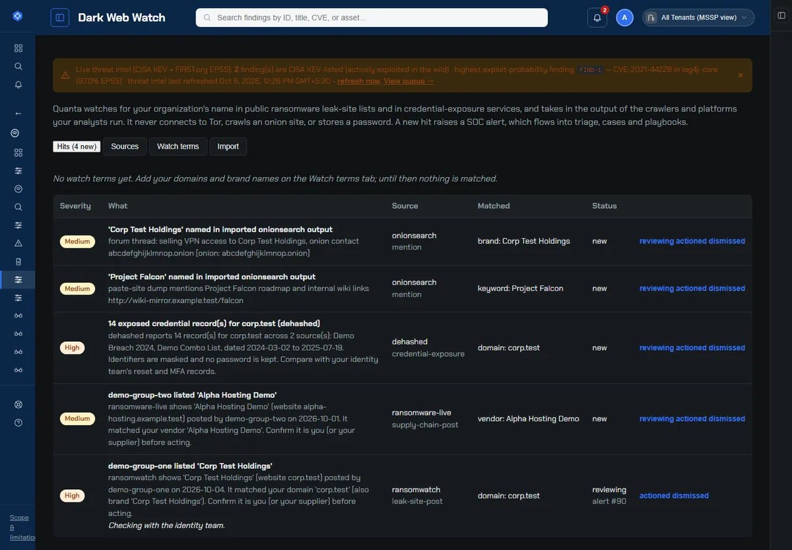</a><br><sub><b>Dark Web Watch</b><br>Admin: ransomware leak-site feeds and credential-exposure lookups matched against your domains and brands, plus import of crawler and platform output</sub></td><td valign="top" width="33%"><a href="docs/images/modules/soc-soar.webp">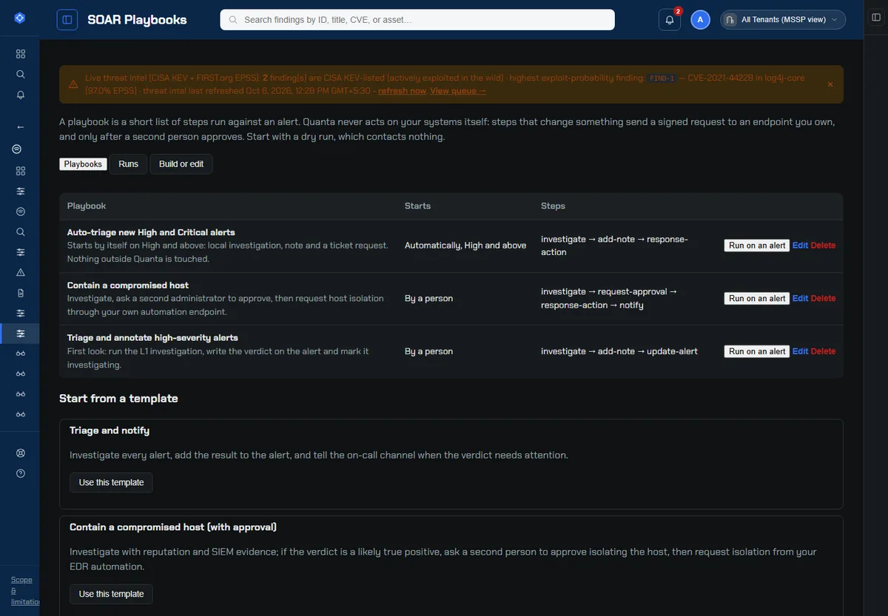</a><br><sub><b>SOAR Playbooks</b><br>Admin: playbooks that investigate, notify and ask your own automation to respond, with a second person approving anything that changes your environment</sub></td><td></td></tr>
<tr><td valign="top" width="33%"><a href="docs/images/modules/soc-incident-report.webp">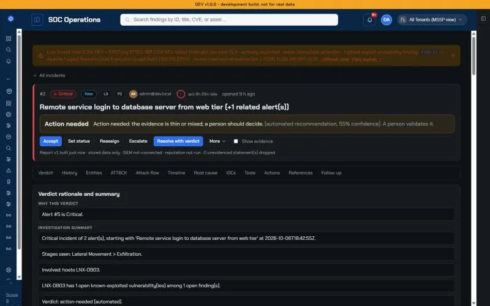</a><br><sub><b>Incident report</b><br>The verdict with its rationale, summary, historical correlation, entities, ATT&amp;CK next steps, IOCs, recommended actions and follow-up questions, every statement tied to evidence</sub></td><td valign="top" width="33%"><a href="docs/images/modules/soc-attack-flow.webp">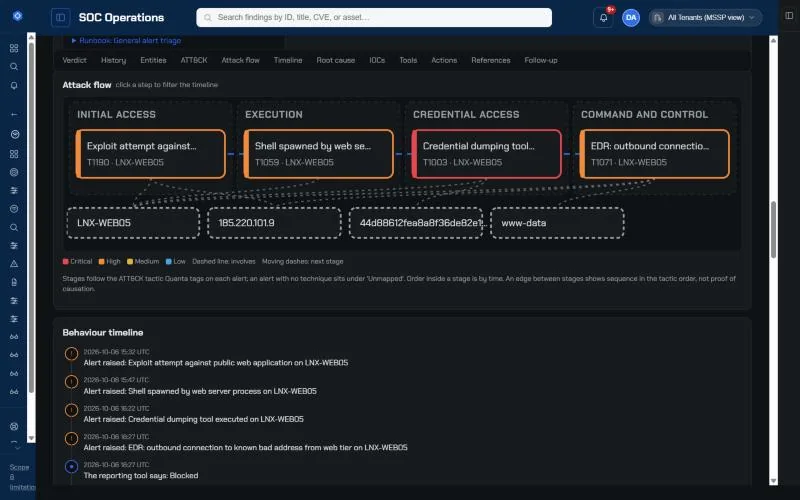</a><br><sub><b>Attack flow and timeline</b><br>Alerts placed by ATT&amp;CK stage with the entities they involve; click a step to filter the behaviour timeline</sub></td><td valign="top" width="33%"><a href="docs/images/modules/soc-attack-matrix.webp">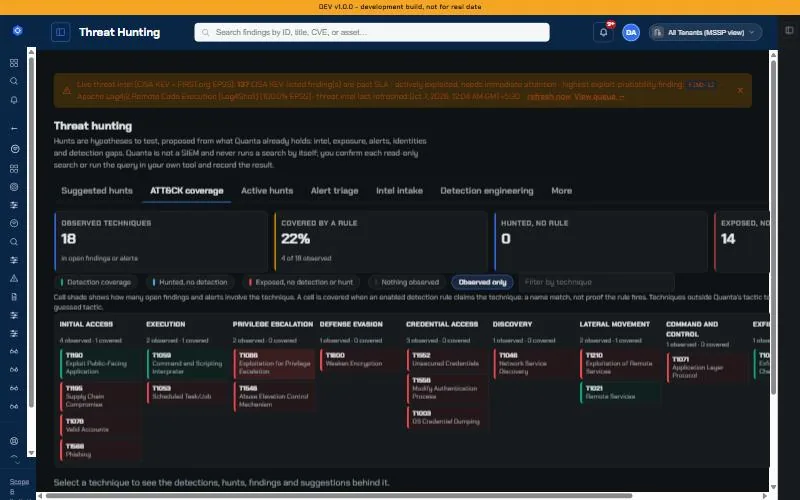</a><br><sub><b>ATT&amp;CK coverage matrix</b><br>Every technique Quanta knows, shaded by exposure and marked covered, hunted or uncovered; click a cell for the rules, hunts and findings behind it</sub></td></tr>
<tr><td valign="top" width="33%"><a href="docs/images/modules/soc-hunt-report.webp">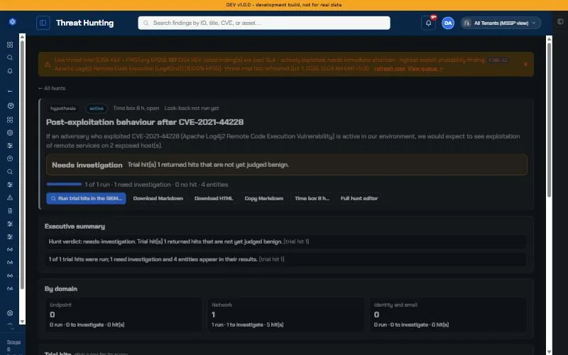</a><br><sub><b>Hunt report</b><br>A hunt's verdict, executive summary, trial hits by domain with their queries, allow-list and detection recommendations</sub></td><td></td><td></td></tr>
</table>

**What it does**

- **Incidents, not cases to create**: every investigated alert is grouped into an incident automatically (shared host, account or public indicator, same-rule bursts, a shared vulnerability, the same technique, kill-chain progression), with the reason stored, a kill-chain view and a deterministic summary. Routing picks the tier and then the analyst (specialty, continuity, lowest sufficient tier, load, shift and capacity) and records a "why routed here" list; with nobody qualified it queues the incident and alerts the lead. Cases (L1/L2/L3 queues, priority from impact × urgency, service-level clocks, hand-off summaries, automatic escalation) are the work item an incident is routed as; manual creation is an audited exception.
- **Investigation reports**: open an incident to a verdict with its rationale, bounded historical correlation, entities, indicators, ATT&CK next steps, an attack flow and recommended actions. Every statement cites evidence; one without it is dropped and counted, and unknown is shown as unknown. Live evidence runs only after you confirm.
- **Alert triage and L1 investigation**: alerts (JSON or OCSF) ranked with vulnerability context, classified, matched to history and indicators, with optional read-only SIEM evidence. The verdict is advice a person validates, and a Critical alert is never called a false positive.
- **Proactive hunt engine and hunt reports**: hypotheses built from intelligence, coverage gaps, baselines, exposure, identity, the Anthropic CVD feed and past outcomes, each with its evidence chain, SPL, KQL and Sigma leads, a scored priority and a data-readiness note that says "cannot tell" rather than guess. Accepting one creates an ordinary hunt; you run the queries in your own SIEM, record the result and close with an outcome, and the hunt report (one row per trial hit, an allow-list, detection recommendations) comes out of it. Quanta runs nothing by itself.
- **Typed decisions and the confidence gate**: the alert verdict, finding routing and "does this need a change approval" are typed decisions with probabilities. The gate sends each to auto, review or a person, and auto is possible only for a reversible, local decision that does not touch your environment; a calibration report shows whether the confidence has been earned. With the shipped starting values nothing auto-closes.
- **Detection engineering**: per-rule true-positive and noise rates over closed alerts, six health tiers (Maintain, Tune, Disable), Sigma before and after tuning, and ATT&CK coverage.
- **SOAR**: validated playbooks. An action that changes the environment needs an approval step before it, a different person approves, dry runs contact nothing, and responses are signed webhooks to endpoints you own.
- **Threat intelligence, Intel Intake and Dark Web Watch**: text or STIX scored for relevance to your estate, leak-site and credential-exposure matching raised as alerts.

**How the work flows**

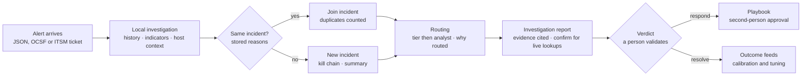
```mermaid
flowchart LR
    A[Alert arrives<br/>JSON, OCSF or ITSM ticket] --> B[Local investigation<br/>history · indicators · host context]
    B --> C{Same incident?<br/>stored reasons}
    C -->|yes| D[Join incident<br/>duplicates counted]
    C -->|no| E[New incident<br/>kill chain · summary]
    D --> F[Routing<br/>tier then analyst · why routed]
    E --> F
    F --> G[Investigation report<br/>evidence cited · confirm for live lookups]
    G --> H{Verdict<br/>a person validates}
    H -->|respond| I[Playbook<br/>second-person approval]
    H -->|resolve| J[Outcome feeds<br/>calibration and tuning]
```

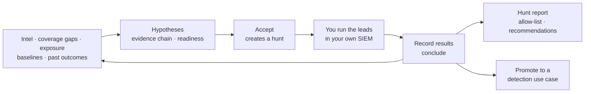
```mermaid
flowchart LR
    A[Intel · coverage gaps · exposure<br/>baselines · past outcomes] --> B[Hypotheses<br/>evidence chain · readiness]
    B --> C[Accept<br/>creates a hunt]
    C --> D[You run the leads<br/>in your own SIEM]
    D --> E[Record results<br/>conclude]
    E --> F[Hunt report<br/>allow-list · recommendations]
    E --> G[Promote to a<br/>detection use case]
    E --> A
```

> [!NOTE]
> **Limits.** Quanta is not a SIEM and runs no queries. It has not been run against a live SIEM, reputation service or ITSM; the models are classical statistics and Naive Bayes, not deep learning, and the decision layer's starting probabilities are stated priors until calibration supports more.


### 2 · Application Security

Know every API you expose, what each returns, and which are risky, then threat-model the systems behind them.

<table>
<tr><td valign="top" width="33%"><a href="docs/images/modules/appsec-app-vulns.webp">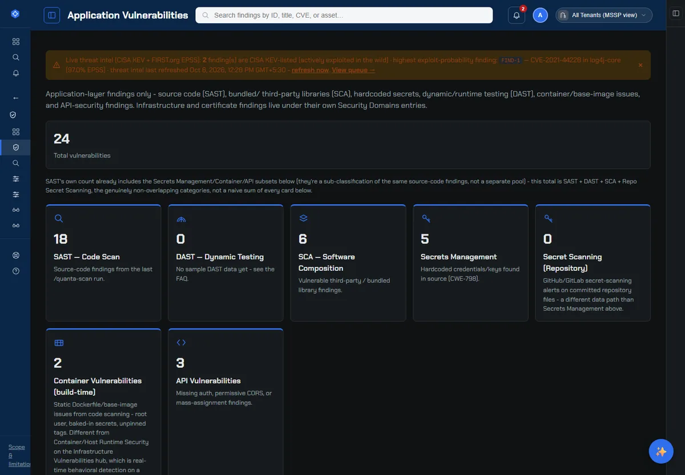</a><br><sub><b>Application Vulnerabilities</b><br>Hub view across SAST, DAST, SCA, Secrets, Container, and API sub-categories - counts and links into each</sub></td><td valign="top" width="33%"><a href="docs/images/modules/appsec-code-scan.webp">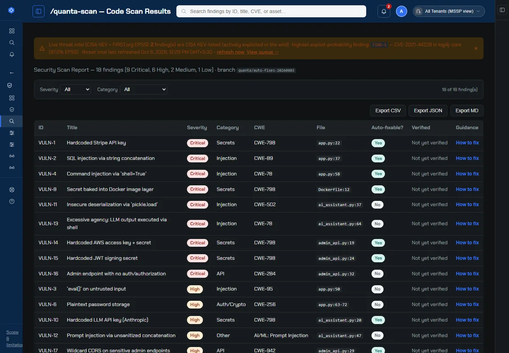</a><br><sub><b>Code Scan</b><br>Source-code findings from /quanta-scan - agentless static analysis, no target install</sub></td><td valign="top" width="33%"><a href="docs/images/modules/appsec-api-security.webp">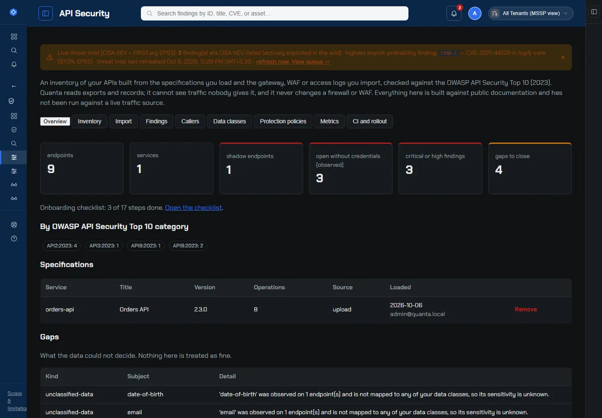</a><br><sub><b>API Security</b><br>Admin: API inventory from specifications and access logs, OWASP API Top 10 findings with evidence and a request to confirm each, caller activity, your data classes, and protection...</sub></td></tr>
<tr><td valign="top" width="33%"><a href="docs/images/modules/appsec-threat-models.webp">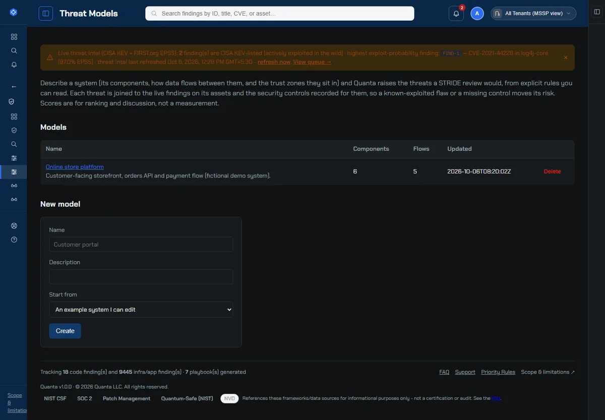</a><br><sub><b>Threat Models</b><br>Admin: describe a system, get STRIDE threats raised by explicit rules, each joined to the live findings and security controls on its assets</sub></td><td></td><td></td></tr>
</table>

**What it does**

- **API security**: an inventory built from OpenAPI or Swagger files and imported gateway, WAF or access logs, with shadow and deprecated endpoints flagged and data sensitivity taken only from the classification framework you import.
- **OWASP API Top 10 (2023) findings** with an evidence chain and a placeholder-only cURL request to confirm a true or false positive, published to the main queue.
- **Caller activity** for investigating scraping and exfiltration, and **protection policies** (rate limit, bad source, data-loss limit, geography, signature) sent as signed requests to an endpoint you own. Blocking needs a second administrator; Quanta changes no WAF.
- **Threat models**: components, data flows and trust zones; STRIDE threats raised by explicit rules, scored (residual = inherent × (1 − 0.7 × control coverage)) and joined to live findings.
- **Application vulnerabilities and code scan**: the application findings queue and the `/quanta-scan` pipeline's results.

**How the work flows**

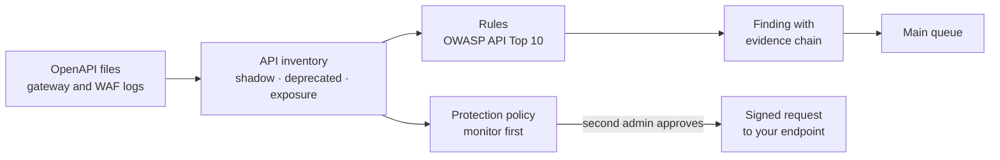
```mermaid
flowchart LR
    A[OpenAPI files<br/>gateway and WAF logs] --> B[API inventory<br/>shadow · deprecated · exposure]
    B --> C[Rules<br/>OWASP API Top 10]
    C --> D[Finding with<br/>evidence chain]
    D --> E[Main queue]
    B --> F[Protection policy<br/>monitor first]
    F -->|second admin approves| G[Signed request<br/>to your endpoint]
```

> [!NOTE]
> **Limits.** Built against public documentation and unit-tested against fakes; not run against a live gateway, WAF or traffic source.


### 3 · DevSecOps & Supply Chain

SBOMs, the dependency and exposure graph, fix pull requests, and the release gate, so a vulnerable package becomes a reviewed upgrade instead of a ticket.

<table>
<tr><td valign="top" width="33%"><a href="docs/images/modules/dso-control-library.webp">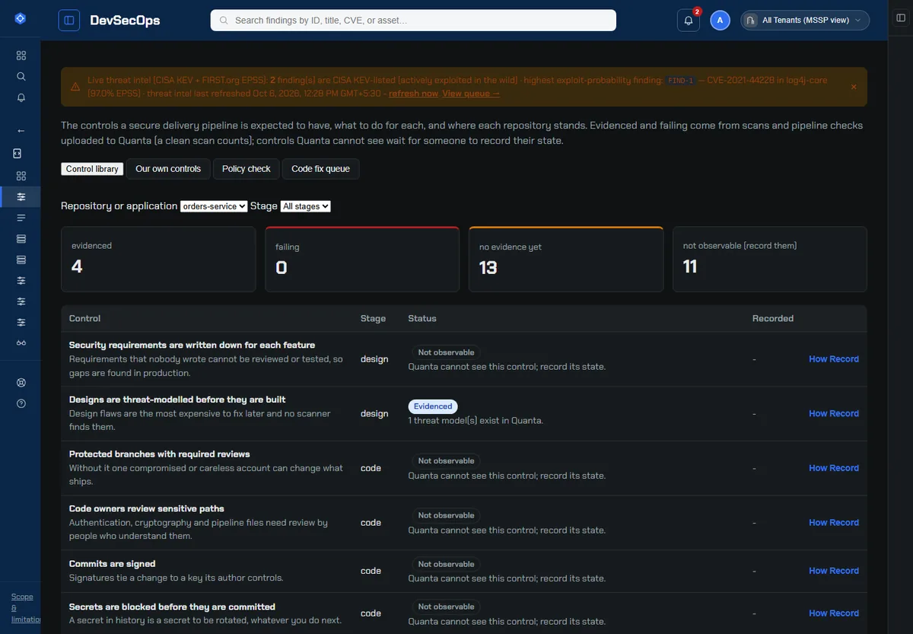</a><br><sub><b>Control Library</b><br>The controls a secure delivery pipeline needs, where each repository stands from uploaded scans and pipeline checks, a policy-to-control check, and the code fix queue</sub></td><td valign="top" width="33%"><a href="docs/images/modules/dso-code-fix-queue.webp">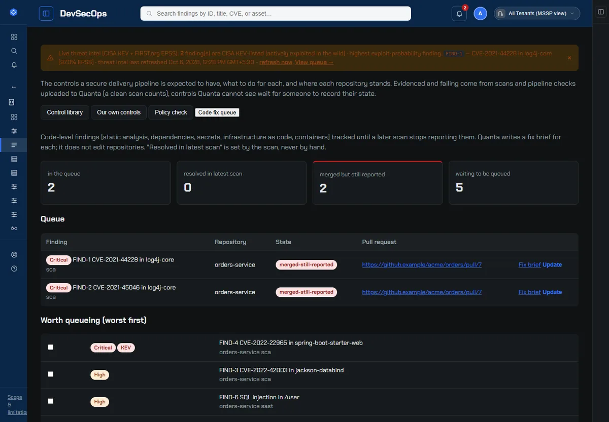</a><br><sub><b>Code Fix Queue</b><br>Static analysis, dependency, secret and infrastructure-as-code findings tracked with a fix brief until a later scan stops reporting them</sub></td><td valign="top" width="33%"><a href="docs/images/modules/dso-applications.webp">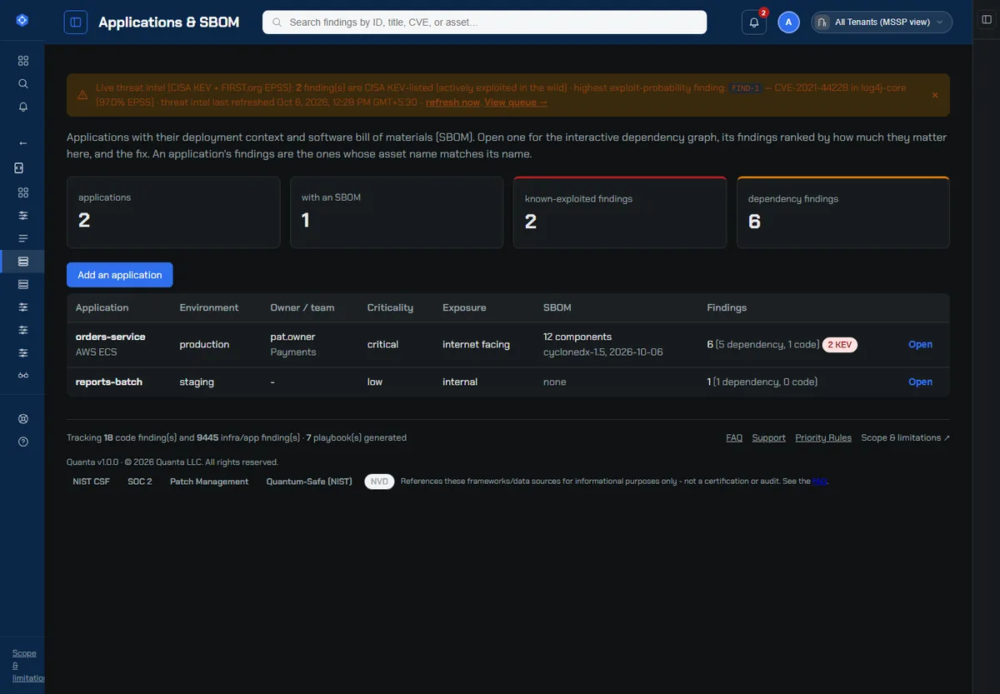</a><br><sub><b>Applications & SBOM</b><br>Each application with its SBOM, an interactive dependency and exposure graph, and its findings ranked with the upgrade that closes the most</sub></td></tr>
<tr><td valign="top" width="33%"><a href="docs/images/modules/dso-graph.webp">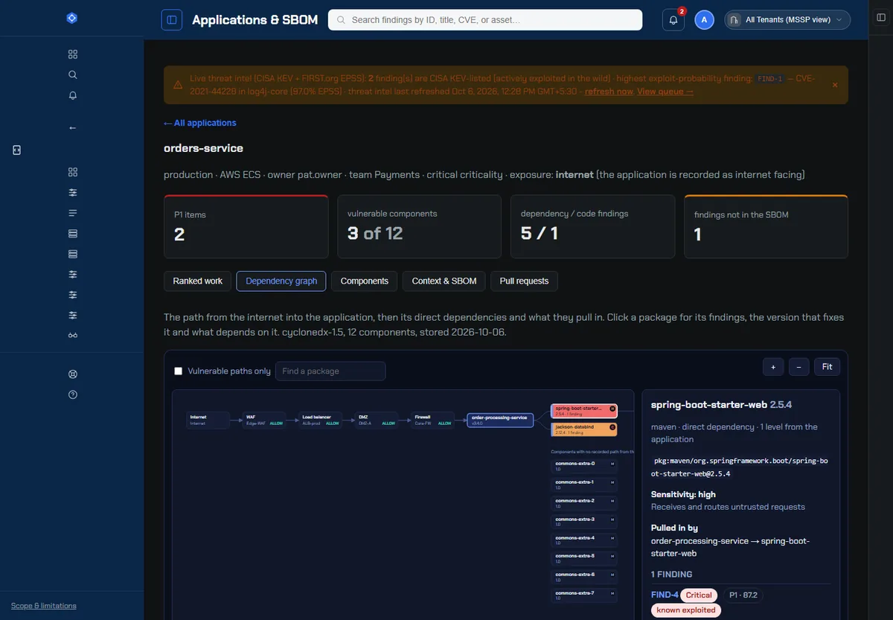</a><br><sub><b>dso-graph</b><br></sub></td><td valign="top" width="33%"><a href="docs/images/modules/dso-dependencies.webp">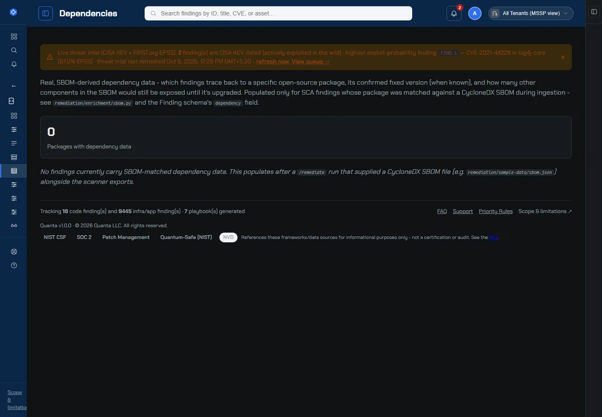</a><br><sub><b>Dependencies</b><br>SBOM-derived blast radius per vulnerable open-source package - which findings trace to it, its confirmed fixed version, and every other component still exposed until it's upgraded</sub></td><td valign="top" width="33%"><a href="docs/images/modules/dso-fix-prs.webp">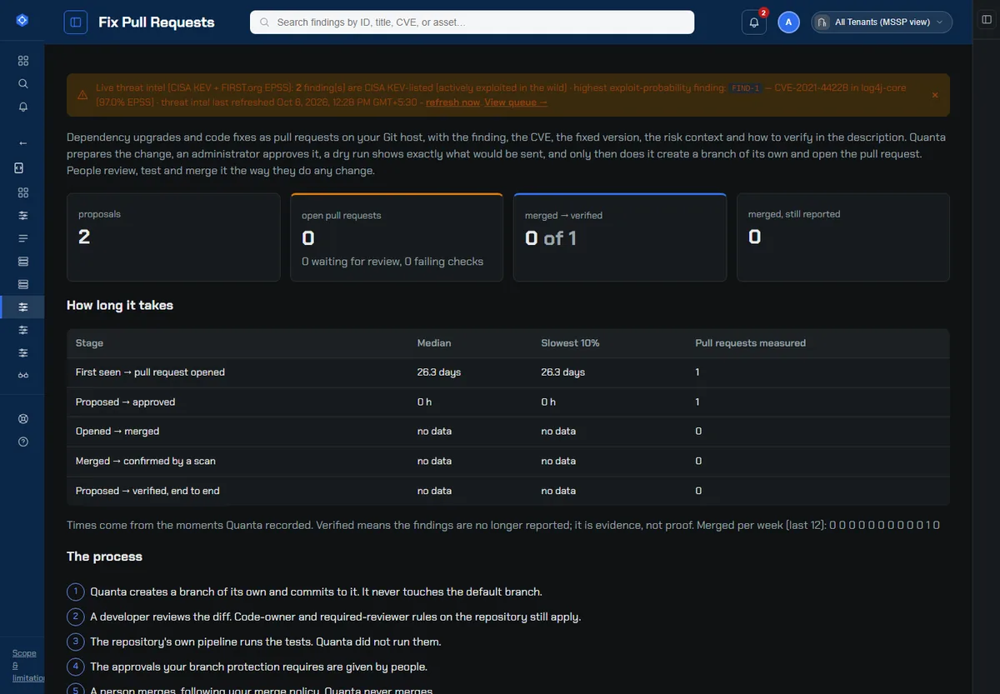</a><br><sub><b>Fix Pull Requests</b><br>Admin: dependency upgrades and code fixes as reviewable pull requests on your Git host, with the evidence in the description</sub></td></tr>
<tr><td valign="top" width="33%"><a href="docs/images/modules/dso-pipeline-gates.webp">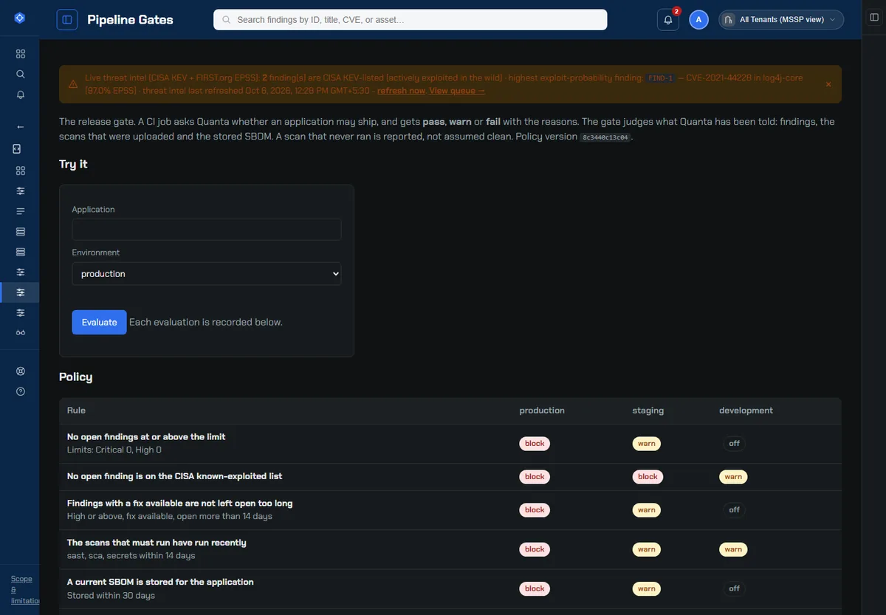</a><br><sub><b>Pipeline Gates</b><br>The release gate a CI job calls before shipping: pass, warn or fail with reasons, per environment, from findings, scans and the SBOM</sub></td><td valign="top" width="33%"><a href="docs/images/modules/dso-secure-design.webp">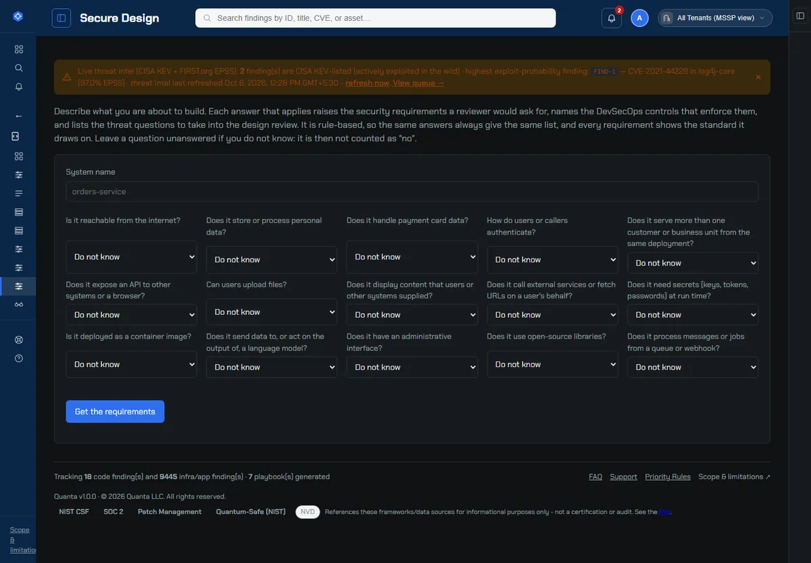</a><br><sub><b>Secure Design</b><br>Answer a few questions about a system you are about to build and get the security requirements, pipeline controls and threat questions it calls for</sub></td><td></td></tr>
</table>

**What it does**

- **Applications and SBOMs**: CycloneDX or SPDX in, or generated from `requirements.txt`, `package.json`, a lock file, `pom.xml` or `go.mod`. Only a lock file gives transitive dependencies, and Quanta says so.
- **Ranked work**: every finding scored with a visible breakdown (CVSS, EPSS, known-exploited, application criticality, package sensitivity, attack surface, network path), with the findings that one upgrade closes grouped together.
- **Interactive dependency and exposure graph** in plain SVG: pan, zoom, search, and the path from the internet to the vulnerable package.
- **Fix pull requests** on GitHub and GitLab: deterministic manifest edits, an evidence-carrying description, administrator approval, a dry run, then a new branch and a pull request. Never the default branch, never merged by Quanta.
- **CI release gate**: `GET /api/gate/evaluate` returns pass, warn or fail with reasons; every evaluation is recorded and used as control evidence.
- **Secure design assistant**, a **27-control library** mapped to OWASP CI/CD and NIST SSDF, and your own organisation-specific controls.

**How the work flows**

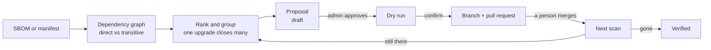
```mermaid
flowchart LR
    A[SBOM or manifest] --> B[Dependency graph<br/>direct vs transitive]
    B --> C[Rank and group<br/>one upgrade closes many]
    C --> D[Proposal<br/>draft]
    D -->|admin approves| E[Dry run]
    E -->|confirm| F[Branch + pull request]
    F -->|a person merges| G[Next scan]
    G -->|gone| H[Verified]
    G -->|still there| C
```

> [!NOTE]
> **Limits.** The Git host connectors and OSV are tested against fakes and not run live. Quanta cannot regenerate lock files or run a project's tests, and it ships no advisory database.


### 4 · Infrastructure & Exposure

Servers, network gear, OT, certificates and the exposure around them: what is reachable, what protects it, and how an attacker could chain it.

<table>
<tr><td valign="top" width="33%"><a href="docs/images/modules/infra-vulns.webp">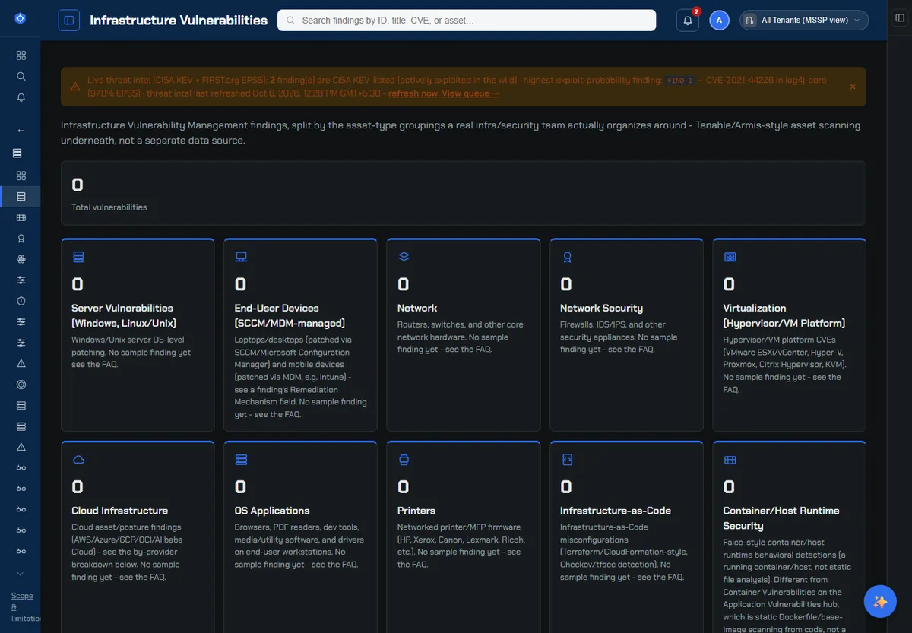</a><br><sub><b>Infrastructure Vulnerabilities</b><br>Hub view across OS, Network, Network Security, OT/IoT, and Cloud sub-categories (Tenable/Armis-style asset scanning)</sub></td><td valign="top" width="33%"><a href="docs/images/modules/infra-ot.webp">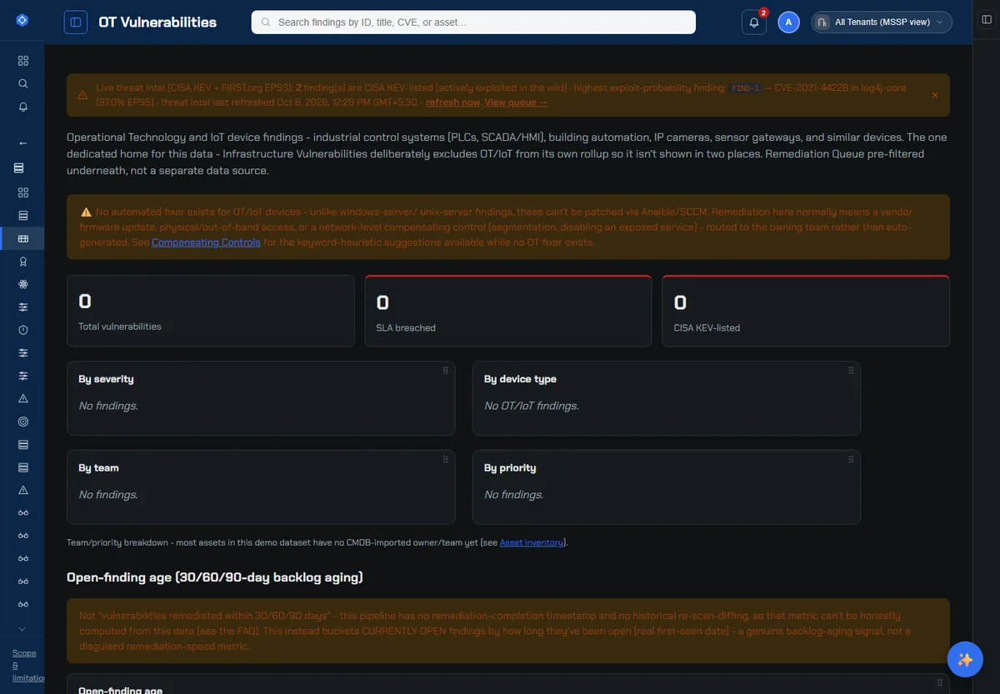</a><br><sub><b>OT Vulnerabilities</b><br>Dedicated hub for Operational Technology/IoT device findings (PLCs, SCADA/HMI, building automation, cameras, sensor gateways) - the same real data as Infrastructure Vulnerabilities' own...</sub></td><td valign="top" width="33%"><a href="docs/images/modules/infra-certificates.webp">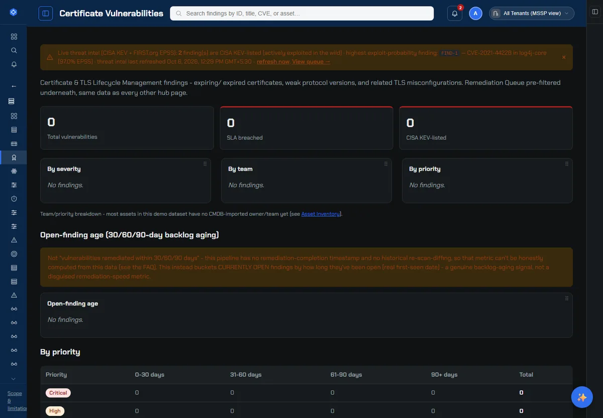</a><br><sub><b>Certificate Vulnerabilities</b><br>Hub view for Certificate & TLS Lifecycle Management findings - KPIs, severity/aging charts, top rankings, and AI trend analysis, same shape as the other Security Domains hubs</sub></td></tr>
<tr><td valign="top" width="33%"><a href="docs/images/modules/infra-quantum.webp">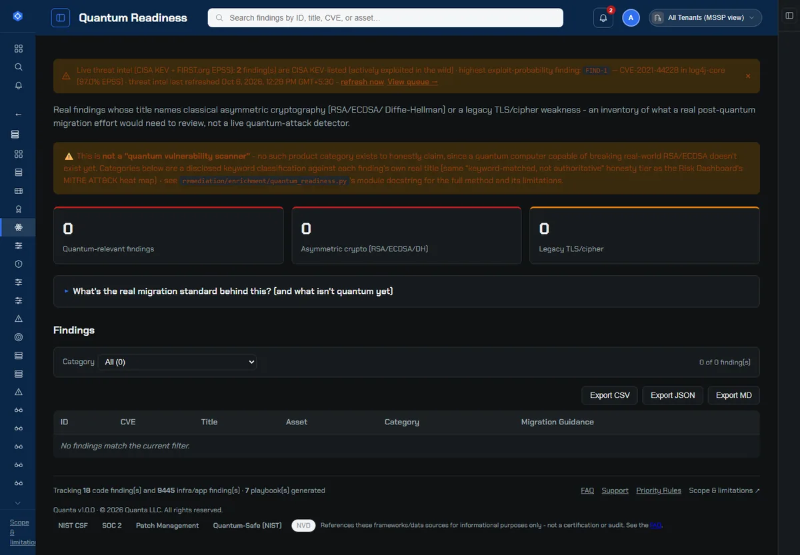</a><br><sub><b>Quantum Readiness</b><br>Real findings naming classical RSA/ECDSA/Diffie-Hellman crypto or a legacy TLS/cipher weakness - a post-quantum migration inventory against real NIST FIPS 203/204/205 + NIST IR 8547 guidance</sub></td><td valign="top" width="33%"><a href="docs/images/modules/infra-compensating.webp">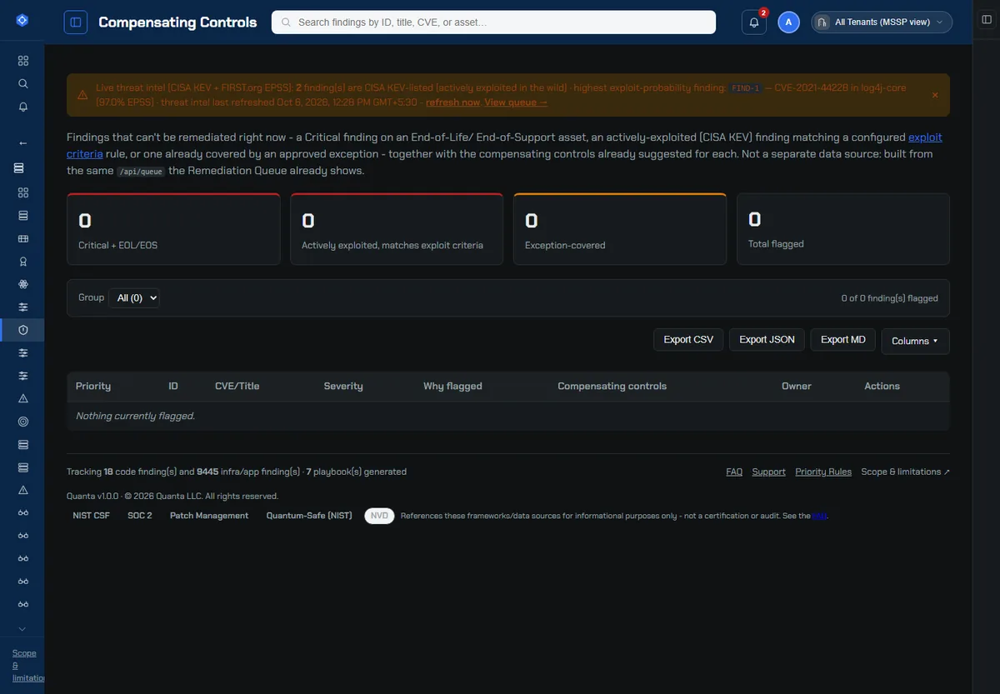</a><br><sub><b>Compensating Controls</b><br>Findings that can't be remediated right now - Critical EOL/EOS, actively-exploited zero-days with no public POC, or an approved exception - with recommended controls for each</sub></td><td valign="top" width="33%"><a href="docs/images/modules/infra-firewall.webp">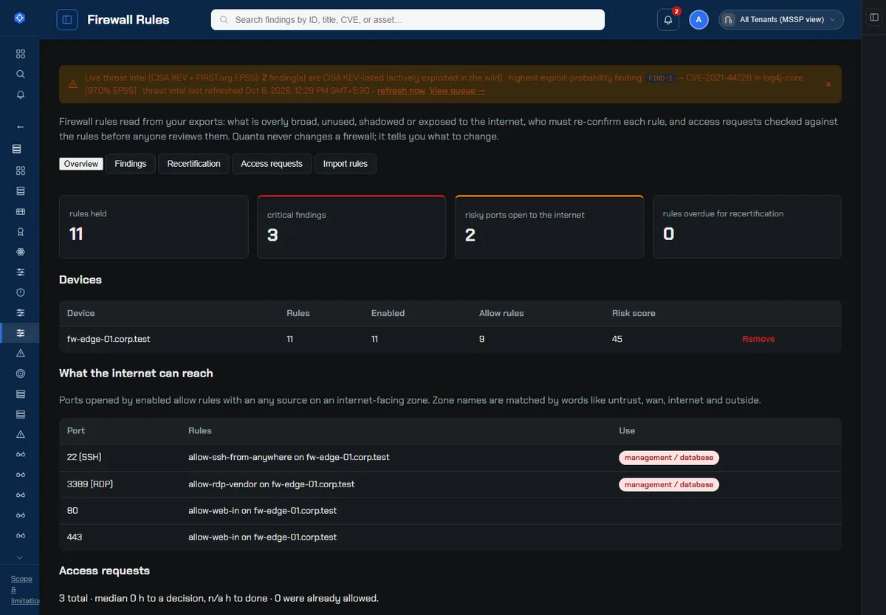</a><br><sub><b>Firewall Rules</b><br>Firewall rules from your exports: broad, unused, shadowed and internet-exposed rules, recertification by owner, and access requests checked against the rules</sub></td></tr>
<tr><td valign="top" width="33%"><a href="docs/images/modules/infra-attack-chains.webp">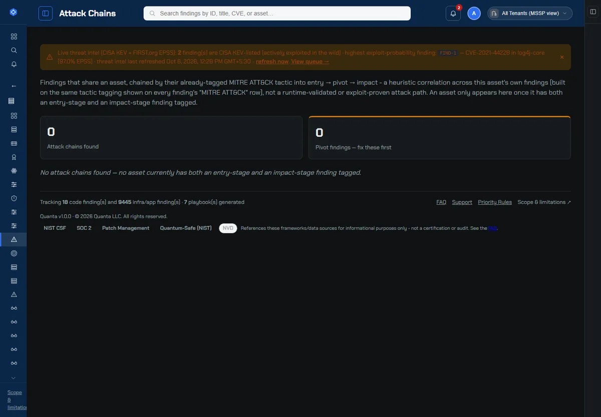</a><br><sub><b>Attack Chains</b><br>Findings on the same asset chained by tagged MITRE ATT&CK tactic into entry -> pivot -> impact - fix the pivot to break the whole chain</sub></td><td valign="top" width="33%"><a href="docs/images/modules/infra-blast-radius.webp">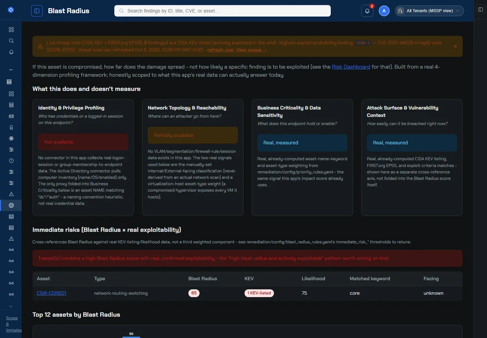</a><br><sub><b>Blast Radius</b><br>If this asset is compromised, how far does the damage spread - business criticality and reachability, cross-referenced against real exploitability</sub></td><td valign="top" width="33%"><a href="docs/images/modules/infra-assets.webp">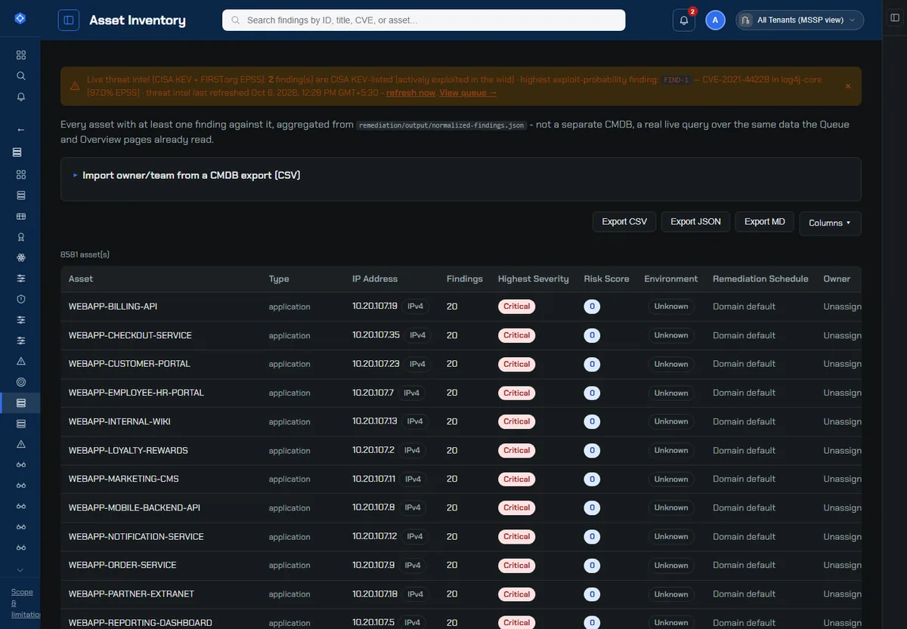</a><br><sub><b>Asset Inventory</b><br>Every asset with findings against it, aggregated, with an editable owner/team</sub></td></tr>
</table>

**What it does**

- **Scanner and asset connectors** (Tenable, Qualys, OpenVAS, Prisma Cloud, Infoblox, Axonius, Active Directory) feeding one **asset inventory** with owners and teams.
- **Infrastructure, OT and certificate vulnerability views** plus **quantum readiness**, each pre-filtered from the same finding store.
- **Firewall rule analysis** from CSV, JSON, PAN-OS XML or FortiGate text: findings FW001 to FW013 (any-any, internet-exposed risky ports, shadowed, stale and more), owner recertification, and access requests checked against the rules.
- **Attack chains** (entry, pivot, impact from tagged ATT&CK tactics) and **blast radius** (SBOM-derived), each honestly empty until the data exists.
- **External attack surface** (`/attack-surface`): import the JSON output of subfinder, dnsx, httpx, naabu and nuclei that you run against domains and ranges you own; Quanta tracks what is new, changed or disappeared between imports, flags anything outside your declared scope without raising findings, and says how old the data is. It never scans and never contacts a target.
- **Compensating controls** and **network reachability** shown on every finding: verified, claimed, absent or unknown, never a guess. **Zero-day watch** matches new CISA KEV entries to your vendor and product vocabulary, and the **Anthropic CVD feed** (Anthropic's public disclosure payload) is matched to your estate there too (a name match is not a version check).

**How the work flows**

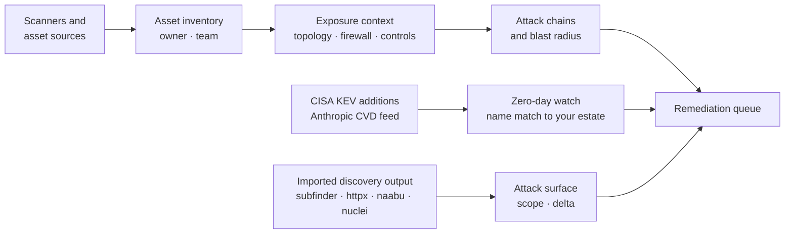
```mermaid
flowchart LR
    A[Scanners and<br/>asset sources] --> B[Asset inventory<br/>owner · team]
    B --> C[Exposure context<br/>topology · firewall · controls]
    C --> D[Attack chains<br/>and blast radius]
    D --> E[Remediation queue]
    F[CISA KEV additions<br/>Anthropic CVD feed] --> G[Zero-day watch<br/>name match to your estate]
    G --> E
    H[Imported discovery output<br/>subfinder · httpx · naabu · nuclei] --> I[Attack surface<br/>scope · delta]
    I --> E
```

> [!NOTE]
> **Limits.** Every connector is built against the vendor's public API and unit-tested against a fake; none has been run against a live vendor account, and the CVD feed parser has never seen the live payload. Quanta never changes a firewall and never scans.


### 5 · AI Security

A register of the AI systems you run, checked against the OWASP LLM Top 10 and MCP guidance, plus what your people actually use.

<table>
<tr><td valign="top" width="33%"><a href="docs/images/modules/ai-vulns.webp">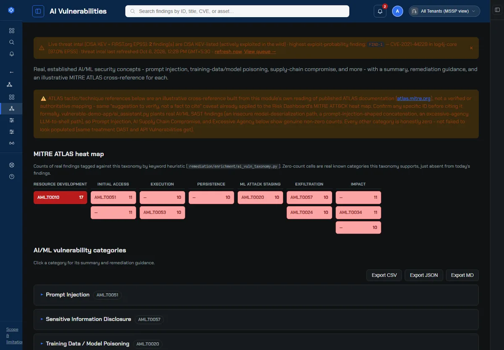</a><br><sub><b>AI Vulnerabilities</b><br>Prompt injection, model poisoning, and other AI/ML risks - with an illustrative MITRE ATLAS heat map, summaries, and remediation guidance</sub></td><td valign="top" width="33%"><a href="docs/images/modules/ai-security.webp">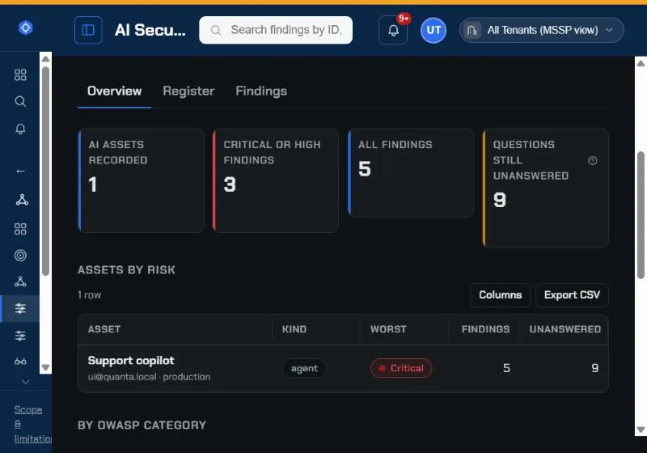</a><br><sub><b>AI Security</b><br>Admin: your AI systems, what each can do and how it is defended, checked against the OWASP Top 10 for LLM Applications and MCP hygiene; publish the findings to the queue</sub></td><td valign="top" width="33%"><a href="docs/images/modules/ai-usage.webp">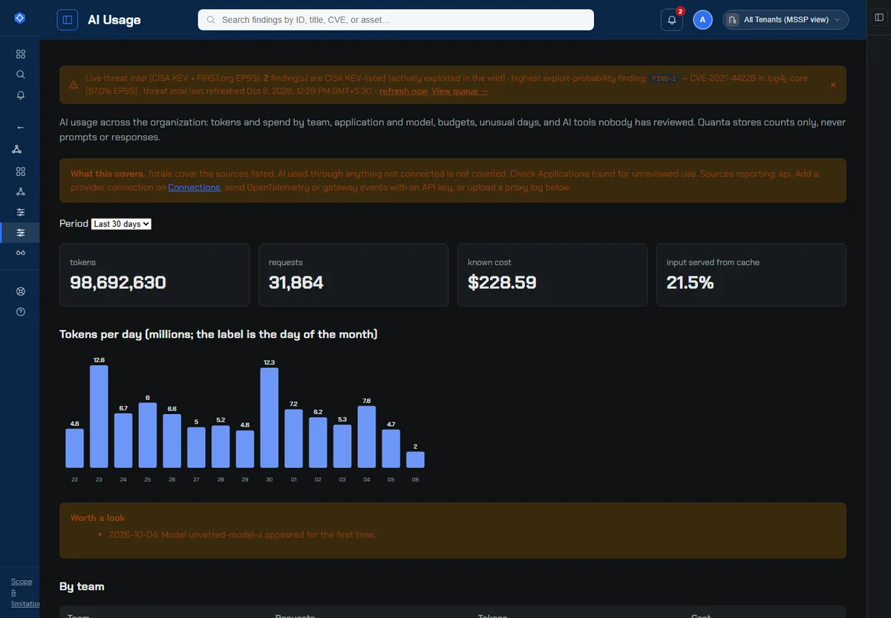</a><br><sub><b>AI Usage</b><br>Admin: AI spend and tokens across the organization by team, application and model, budgets, unusual days, and AI tools nobody reviewed</sub></td></tr>
</table>

**What it does**

- **AI Security**: systems checked against the OWASP LLM Top 10 (2025), MCP exposure and governance with explicit rules. An unanswered question is a gap, not a pass.
- **Agents, tools and MCP servers in the register**: provider, model ids, tools (scope, side effect, whether a person approves each call), MCP servers (transport, authentication, token audience, allowlist, sandbox, egress) and the AI lifecycle (prompt versioning, evaluation, release, observability). Rules cover the MCP controls (MCP001 to MCP008), agent-harness rules such as untrusted content reaching a side-effect tool with no approval (AGT001 to AGT004) and AI lifecycle gaps (AIDLC001 to AIDLC004), each with the exact setting that closes it. Quanta reads what you record; it does not connect to a server or probe an agent.
- **A read-only MCP endpoint of Quanta's own** (Connections): off by default, a key with the `mcp:read` scope only, team-scoped, audited, seven read tools. See [docs/MCP_ENDPOINT.md](docs/MCP_ENDPOINT.md).
- **AI Vulnerabilities**: findings on AI/ML systems, pre-filtered from the shared queue.
- **AI Usage**: counts (never prompt text) from the Anthropic Usage and Cost Admin API, OpenAI organisation usage and OTLP. Cost is reported, estimated from your price list, or unknown, never zero.
- **Discovery** of unreviewed AI applications from proxy or DNS exports.

**How the work flows**

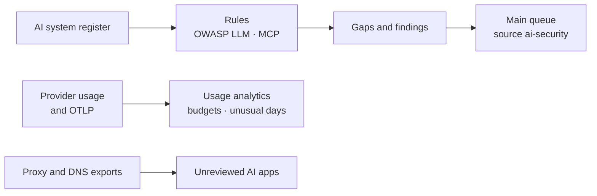
```mermaid
flowchart LR
    A[AI system register] --> D[Rules<br/>OWASP LLM · MCP]
    B[Provider usage<br/>and OTLP] --> E[Usage analytics<br/>budgets · unusual days]
    C[Proxy and DNS exports] --> F[Unreviewed AI apps]
    D --> G[Gaps and findings]
    G --> H[Main queue<br/>source ai-security]
```

> [!NOTE]
> **Limits.** Rule-based checks on what you record; Quanta does not inspect model weights or prompts.


### 6 · Remediation & Workflow

From a ranked queue to a verified fix, with owners, approvals and tickets, and a rule that nothing it generates runs by itself.

<table>
<tr><td valign="top" width="33%"><a href="docs/images/modules/rem-queue.webp">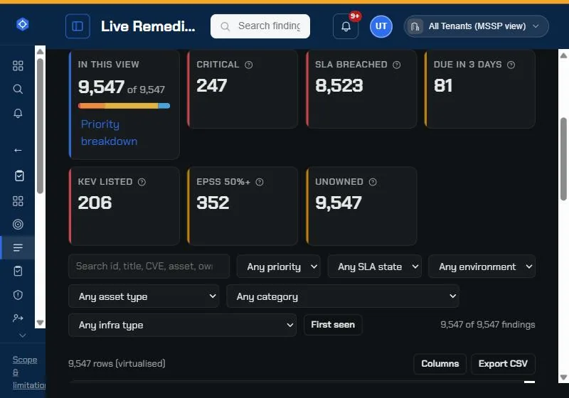</a><br><sub><b>Remediation Queue</b><br>The live, re-scored queue - priority, SLA, KEV/EPSS, and ATT&CK tags per finding</sub></td><td valign="top" width="33%"><a href="docs/images/modules/rem-plan.webp">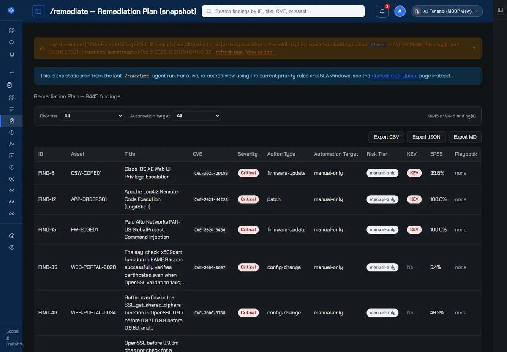</a><br><sub><b>Remediation Plan</b><br>The static plan snapshot from the last /remediate run, linked to generated playbooks</sub></td><td valign="top" width="33%"><a href="docs/images/modules/rem-approvals.webp">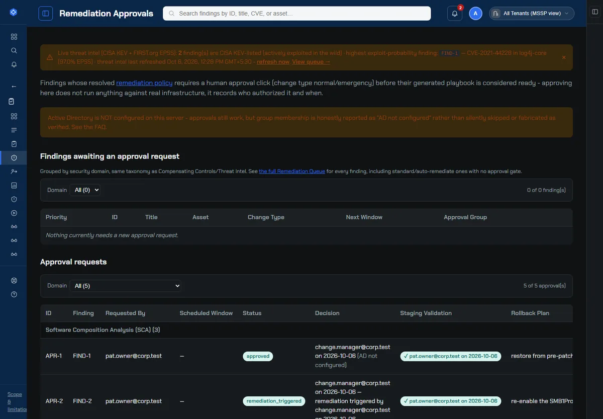</a><br><sub><b>Remediation Approvals</b><br>Human-in-the-loop approve/reject for normal/emergency-change-type findings - AD-group-validated when Active Directory is configured</sub></td></tr>
<tr><td valign="top" width="33%"><a href="docs/images/modules/rem-assignments.webp">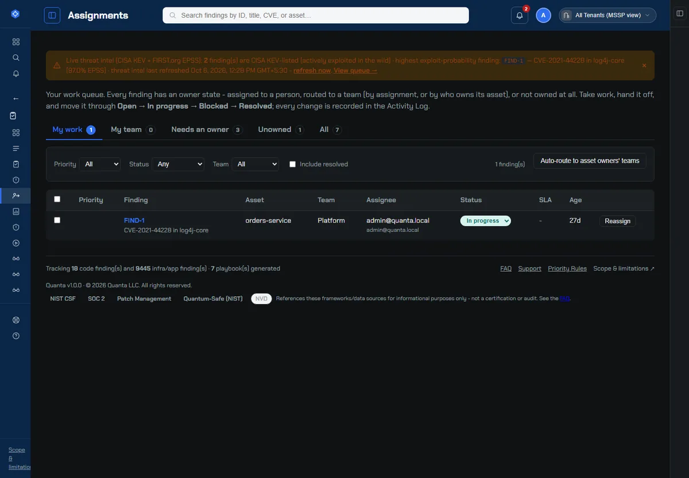</a><br><sub><b>Assignments</b><br>The work queue: findings assigned to you, routed to your team, or still waiting for an owner - assign, track status, and hand off, like an ITSM ticket queue</sub></td><td valign="top" width="33%"><a href="docs/images/modules/rem-exceptions.webp">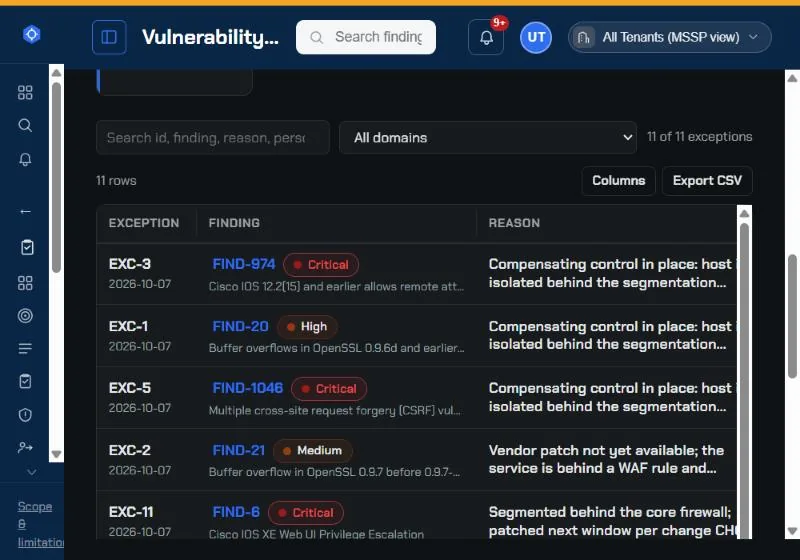</a><br><sub><b>Exceptions</b><br>Request, approve, and track time-boxed risk-acceptance waivers per finding</sub></td><td valign="top" width="33%"><a href="docs/images/modules/rem-run.webp">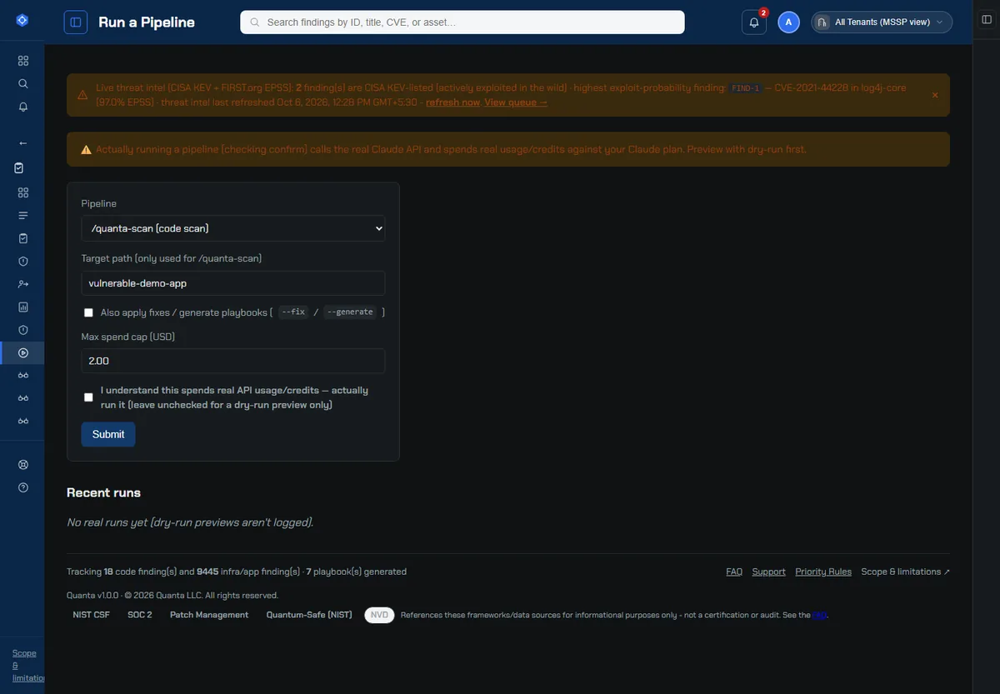</a><br><sub><b>Run Pipeline</b><br>Trigger /quanta-scan or /remediate - dry-run preview by default</sub></td></tr>
</table>

**What it does**

- **Live queue**: every finding re-scored from the YAML priority rules on each load, with SLA clocks, KEV and EPSS-aware priority, and ATT&CK tags.
- **Plan and risk tiers**: auto-approvable, needs change approval, manual only, with a rollback plan and rollout rings (canary, pilot, broad).
- **Approvals**: the approver is checked against an Active Directory group, and a playbook that fails the lint (rollback, approval gate, no literal credentials, no `hosts: all`) cannot be approved.
- **Assignments, ownership and exceptions**: people and teams, auto-routing from asset ownership, time-boxed risk acceptance that expires.
- **Tickets**: ServiceNow and Jira push with state mapped back. **Closed-loop verification** marks a fix verified only when the next scan no longer reports it.

**How the work flows**

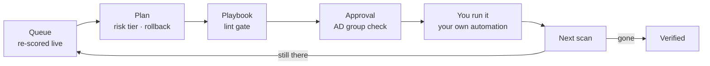
```mermaid
flowchart LR
    A[Queue<br/>re-scored live] --> B[Plan<br/>risk tier · rollback]
    B --> C[Playbook<br/>lint gate]
    C --> D[Approval<br/>AD group check]
    D --> E[You run it<br/>your own automation]
    E --> F[Next scan]
    F -->|gone| G[Verified]
    F -->|still there| A
```

> [!NOTE]
> **Limits.** Fixers need the Claude Code CLI. Playbooks are unreviewed drafts and must not run on real infrastructure without review.


### 7 · Risk, Governance & Compliance

Evidence and workflow for the people who answer to auditors and boards. Quanta supplies the evidence; it does not certify compliance.

<table>
<tr><td valign="top" width="33%"><a href="docs/images/modules/grc-risk-dashboard.webp">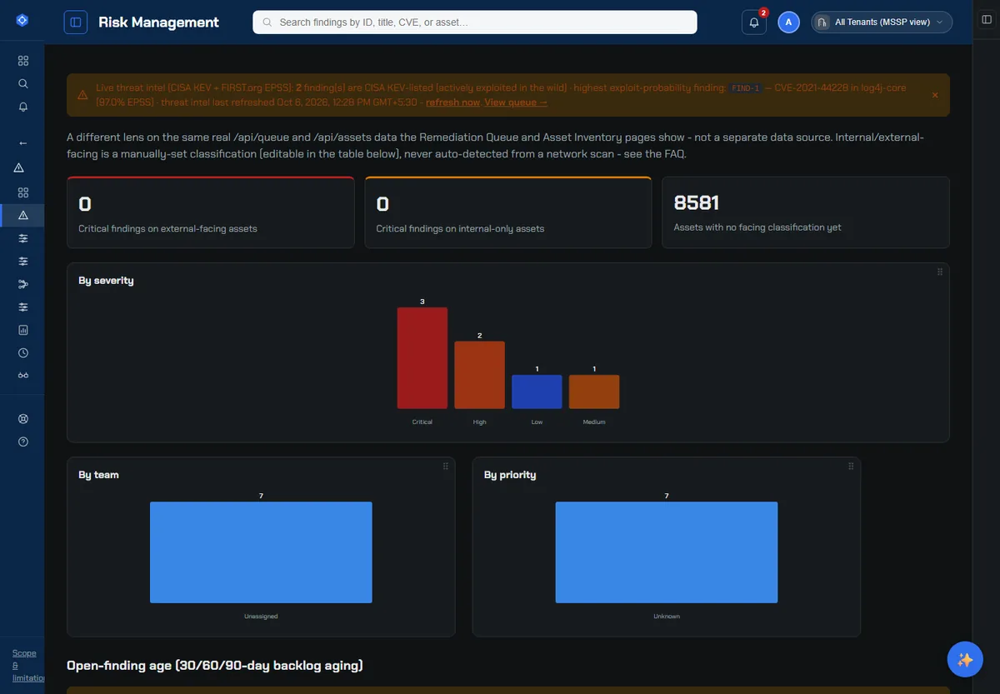</a><br><sub><b>Risk Dashboard</b><br>MITRE ATT&CK heat map, top critical assets, and internal/external-facing exposure</sub></td><td valign="top" width="33%"><a href="docs/images/modules/grc-cyber-risk.webp">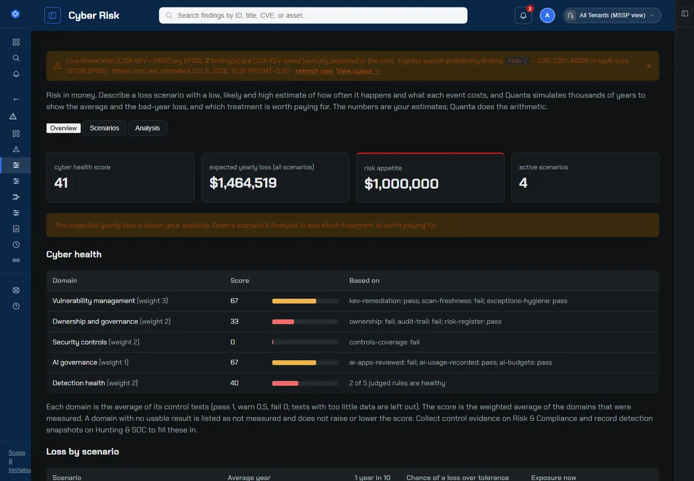</a><br><sub><b>Cyber Risk</b><br>Admin: risk in money</sub></td><td valign="top" width="33%"><a href="docs/images/modules/grc-compliance.webp">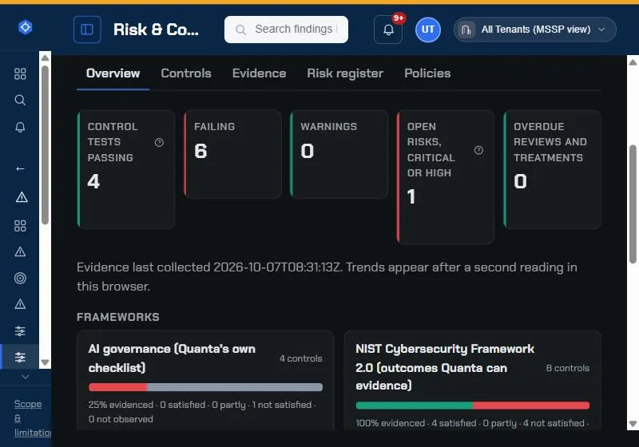</a><br><sub><b>Risk & Compliance</b><br>Admin: control framework coverage with automated evidence, the risk register, attestations and policies</sub></td></tr>
<tr><td valign="top" width="33%"><a href="docs/images/modules/grc-ml-insights.webp">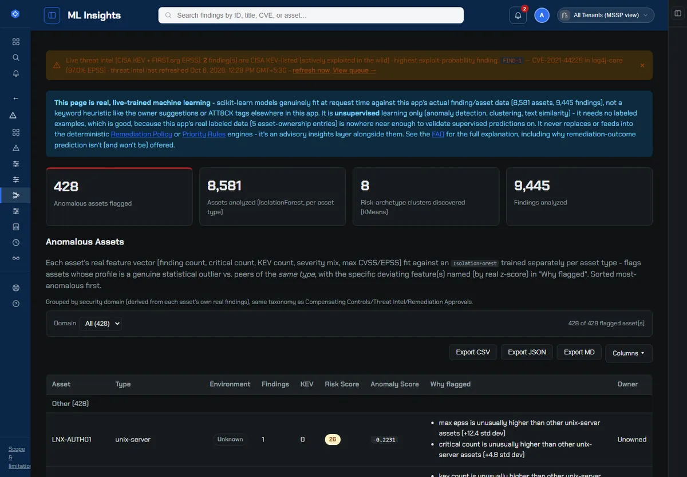</a><br><sub><b>ML Insights</b><br>Real, live-trained scikit-learn models (IsolationForest anomaly detection, KMeans risk clustering) - unsupervised, advisory, and never a replacement for the deterministic policy/priority...</sub></td><td valign="top" width="33%"><a href="docs/images/modules/grc-access.webp">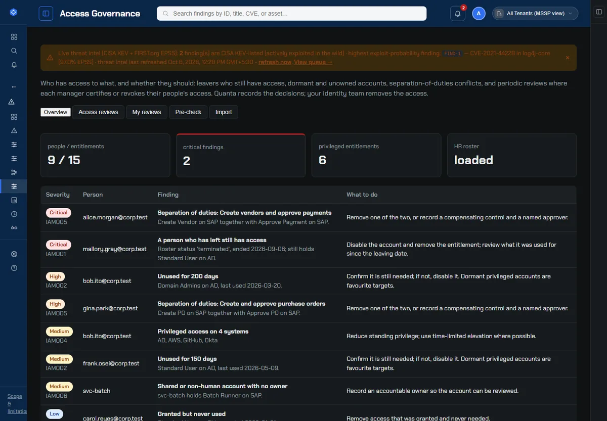</a><br><sub><b>Access Governance</b><br>Leavers with access, dormant and unowned accounts, separation-of-duties conflicts, and manager access reviews</sub></td><td valign="top" width="33%"><a href="docs/images/modules/grc-reports.webp">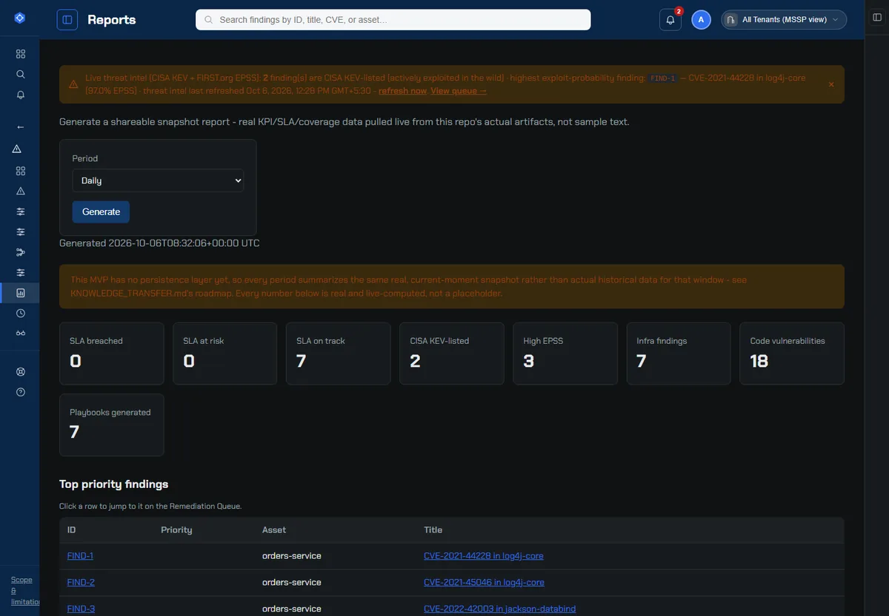</a><br><sub><b>Reports</b><br>Generate a shareable KPI/SLA/coverage report snapshot</sub></td></tr>
</table>

**What it does**

- **Security Posture Review** (`/posture`): the recorded estate and this deployment assessed against ten frameworks (zero trust, secure by design, threat modelling, defence in depth, architecture, SDLC, AI lifecycle, software and AI supply chain, open source), 194 checks in all. A check is pass, partial, gap or not observable; what cannot be observed is listed, not counted, and every gap names the setting that closes it.
- **Relationship graphs and an ontology**: every module has an interactive graph built from its own data (clusters, choke points, shortest routes, in the browser), and a typed vocabulary with provenance answers multi-hop questions across them.
- **GRC**: framework catalogs (NIST 800-53, CSF 2.0, an AI-governance set, or a full OSCAL import), a risk register with suggestions from live findings, automated control tests (too little data gives n/a, never a pass), attestations, versioned policies and an OSCAL assessment-results export.
- **Cyber risk**: FAIR-style Monte Carlo (annual loss expectancy, P90 and P95, treatment ROI) and a cyber health score. The inputs are your estimates.
- **Access governance**: findings IAM001 to IAM007 (leavers, dormant, separation of duties and more), manager access reviews and an SoD pre-check.
- **ML Insights**: scikit-learn anomaly detection and risk clustering, unsupervised and advisory, never a replacement for the deterministic priority rules.
- **Reports and the activity log**: downloadable KPI and SLA snapshots, scheduled email delivery, and an audit trail.

**How the work flows**

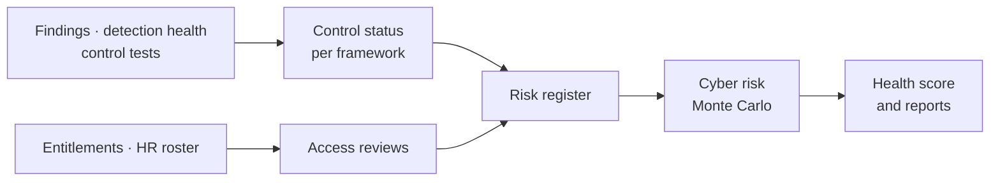
```mermaid
flowchart LR
    A[Findings · detection health<br/>control tests] --> B[Control status<br/>per framework]
    B --> C[Risk register]
    C --> D[Cyber risk<br/>Monte Carlo]
    D --> E[Health score<br/>and reports]
    F[Entitlements · HR roster] --> G[Access reviews]
    G --> C
```

> [!NOTE]
> **Limits.** The risk inputs are estimates you supply. Control-test thresholds are policy files you own.


### 8 · Administration

Everything that keeps the platform safe to run, always included in every licence.

<table>
<tr><td valign="top" width="33%"><a href="docs/images/modules/admin-connections.webp">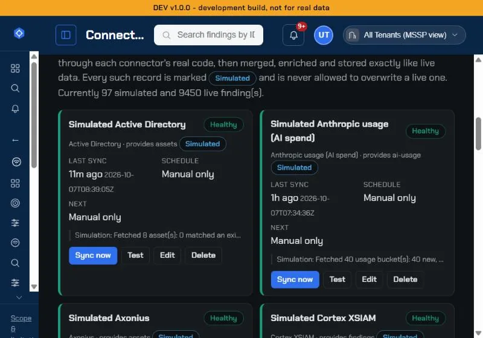</a><br><sub><b>Search, reputation and response endpoints</b><br>Splunk search, VirusTotal, notification and response webhooks</sub></td><td valign="top" width="33%"><a href="docs/images/modules/admin-priority-rules.webp">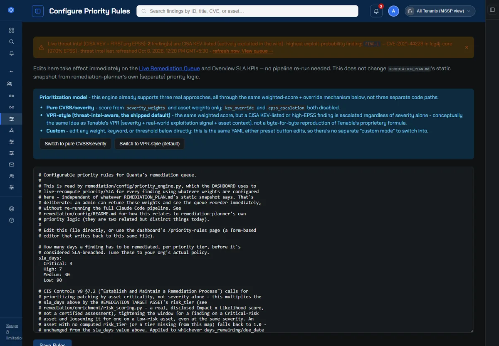</a><br><sub><b>Priority Rules</b><br>Tune severity/asset/KEV/EPSS weights and SLA windows - takes effect immediately</sub></td><td valign="top" width="33%"><a href="docs/images/modules/admin-people.webp">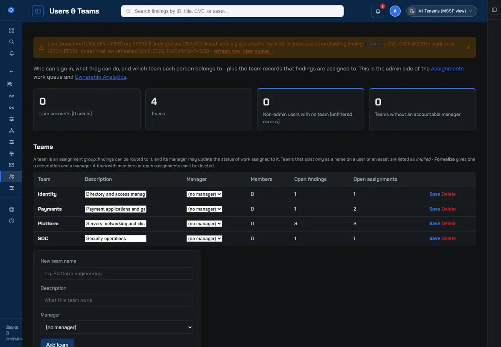</a><br><sub><b>Users & Teams</b><br>Admin-only: user accounts and roles, team records and managers, who is on which team, each person's live workload, and the auto-routing rule</sub></td></tr>
<tr><td valign="top" width="33%"><a href="docs/images/modules/help-support.webp">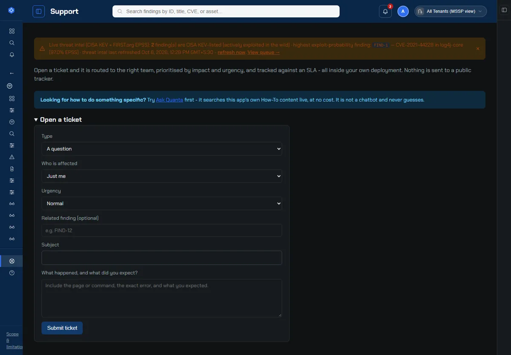</a><br><sub><b>Support</b><br>How to get help, report a bug, and where the deeper docs live</sub></td><td></td><td></td></tr>
</table>

**What it does**

- **Connections**: credentials encrypted at rest (Fernet, key rotation), syncs scheduled through a durable job queue, and every connection type described as JSON Schema.
- **Policies you edit in the app**: Priority Rules, Exploit Criteria, Remediation Policy, Asset Policy and Notification Settings, applied immediately.
- **Users, teams and API keys**: local accounts or OIDC, an admin and user role narrowed by team, and scoped keys (`ingest:write`, `read:findings`, `tickets:update`, `soc:write`, `asm:write`, `mcp:read` and more, optionally bound to one team) stored as hashes.
- **Integrity and self-heal**: a SHA-256 baseline of the released code, read-only checks of the stores (database, schema, findings file, locks, snapshots, disk, clock, key and licence expiry) and four confirm-gated repairs, each logged. "Could not check" is never shown as OK.
- **Environments, releases and simulation**: dev, test and prod from one image (`QUANTA_ENV`), a release preflight and a printed rollback plan, per-environment feature flags, and simulated connectors that are refused in prod unless an operator allows them.
- **Support**: a real helpdesk with SLAs, routing rules, escalation and CSAT, kept inside Quanta.
- **Module licensing**: a signed, offline-verified licence that works air-gapped; it starts in a non-blocking warn mode.

**How the work flows**

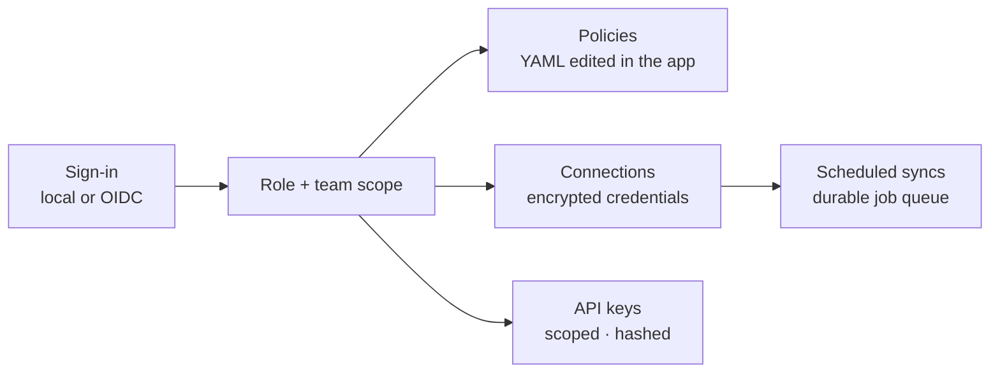
```mermaid
flowchart LR
    A[Sign-in<br/>local or OIDC] --> B[Role + team scope]
    B --> C[Policies<br/>YAML edited in the app]
    B --> D[Connections<br/>encrypted credentials]
    D --> E[Scheduled syncs<br/>durable job queue]
    B --> F[API keys<br/>scoped · hashed]
```

> [!NOTE]
> **Limits.** No granular permission matrix: two roles plus team scoping. Reads are public unless login is required, and production mode requires it.

---

## 🔧 How it works

### The path every finding takes

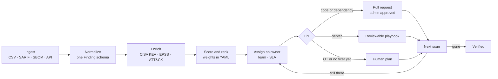
```mermaid
flowchart LR
    A[Ingest<br/>CSV · SARIF · SBOM · API] --> B[Normalize<br/>one Finding schema]
    B --> C[Enrich<br/>CISA KEV · EPSS · ATT&CK]
    C --> D[Score and rank<br/>weights in YAML]
    D --> E[Assign an owner<br/>team · SLA]
    E --> F{Fix}
    F -->|code or dependency| G[Pull request<br/>admin approved]
    F -->|server| H[Reviewable playbook]
    F -->|OT or no fixer yet| I[Human plan]
    G --> J[Next scan]
    H --> J
    I --> J
    J -->|gone| K[Verified]
    J -->|still there| E
```

Scoring and thresholds are deterministic and live in YAML under `remediation/config/`; an administrator edits them in the app and the queue re-scores immediately.

### The two Claude Code pipelines

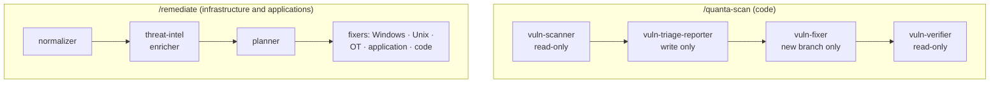
```mermaid
flowchart TB
    subgraph scan["/quanta-scan  (code)"]
      direction LR
      s1[vuln-scanner<br/>read-only] --> s2[vuln-triage-reporter<br/>write only] --> s3[vuln-fixer<br/>new branch only] --> s4[vuln-verifier<br/>read-only]
    end
    subgraph rem["/remediate  (infrastructure and applications)"]
      direction LR
      r1[normalizer] --> r2[threat-intel<br/>enricher] --> r3[planner] --> r4[fixers: Windows · Unix ·<br/>OT · application · code]
    end
```

Twelve subagents in all, each with a **deliberately narrow tool list** (the scanner cannot write; the fixers can only read and write files and have no shell). That scoping is the safety boundary, not a convenience.

### Fix pull request lifecycle

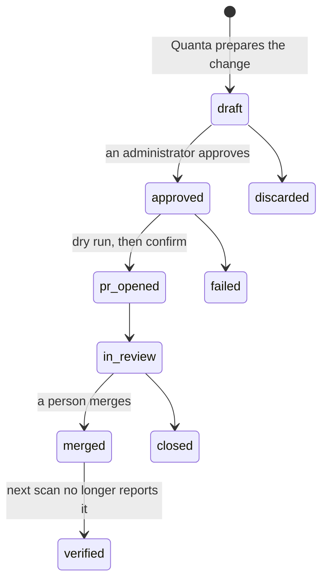
```mermaid
stateDiagram-v2
    [*] --> draft: Quanta prepares the change
    draft --> approved: an administrator approves
    approved --> pr_opened: dry run, then confirm
    pr_opened --> in_review
    in_review --> merged: a person merges
    in_review --> closed
    merged --> verified: next scan no longer reports it
    draft --> discarded
    approved --> failed
```

The pull request is the **only** place Quanta writes to a repository: always a new branch, never the default or a protected branch, never merged by Quanta. State comes back by a signed webhook, an hourly follow-up, or a manual check.

---

## 🛡 The safety model

> [!IMPORTANT]
> **Nothing Quanta generates runs on its own.** Everything below is enforced in code and covered by tests, not just promised in a document.

- **Generate, never execute.** Fixers write playbooks, plans or diffs for people (or your own approved automation) to run.
- **Dry run by default**, with an explicit confirm and an administrator login for every action that spends money or touches another system.
- **Pull requests**: new branch only, approval first, denied paths (pipeline files, CODEOWNERS, keys), no force-push, no merge, no package manager, no test run.
- **Honest data**: KEV and EPSS apply only to findings with a CVE; an unmeasured domain is listed, not counted; "unknown" is shown instead of a guess; verification is evidence from the next scan, not proof.
- **Hardened by default**: a same-origin-only Content-Security-Policy in production, a self-hosted font (no third-party request), throttled failed sign-ins, a `Secure` session cookie over HTTPS, and a guard that refuses XML entity declarations in anything Quanta parses from outside.
- **Confidence gate**: a decision acts without a person only when it is reversible, local and does not touch an environment (the last part is fixed in code, not in a file you can edit); a Critical alert is never auto-closed.
- **Read-only by construction** where it matters: the MCP endpoint registers read tools only and refuses to register another kind; Quanta never scans a target, changes a firewall, WAF or SIEM, merges a pull request or runs a generated playbook.
- **Credentials** are encrypted at rest, passed as constructor arguments, and never put in an error message.

> [!WARNING]
> `vulnerable-demo-app/` is intentionally insecure and exists only to be scanned. Never deploy it anywhere reachable.

---

## ⚖️ How Quanta compares

Quanta overlaps with several kinds of product but replaces none of them completely. The honest way to read this table is by category: what each kind of tool is strongest at, what Quanta covers, and where Quanta stops. Statements about other products come from their own published descriptions (linked below the table); where a vendor's feature set is deep, Quanta does not claim parity.

| Category | Examples | What they are strongest at | What Quanta covers | Where Quanta stops |
|---|---|---|---|---|
| **Vulnerability management** | Tenable, Qualys, Rapid7 (commercial); OpenVAS, DefectDojo (open source) | Running the scans, proprietary risk scores that blend CVSS, threat intelligence and asset criticality[^vm], and (DefectDojo) importing and de-duplicating findings from 200+ tools[^dd] | Reads their output, ranks it with a visible, tunable breakdown, assigns owners, and verifies fixes against the next scan | No scanning engine or agents; a smaller set of import connectors, none verified against a live tenant |
| **Application security posture (ASPM)** | Apiiro, Cycode, OX Security (commercial) | Correlating and de-duplicating findings from many AppSec scanners into one prioritised view, with deep source-control and CI/CD integration[^aspm] | A graph-based, application-centred ranking, fix pull requests, a release gate, and a library of pipeline controls | No code scanning of its own beyond the `/quanta-scan` pipeline; narrower scanner integrations |
| **Software composition and SBOM** | OWASP Dependency-Track (open source) | Continuous component analysis of CycloneDX SBOMs against many vulnerability sources, policy, and VEX[^dt] | SBOM ingest and generation, a direct and transitive dependency graph, blast radius, and upgrade pull requests | Ships no advisory database: vulnerabilities come from scanner findings or the OSV check; no VEX export |
| **Threat modelling** | IriusRisk, ThreatModeler (commercial); OWASP Threat Dragon (open source) | Diagram-driven modelling, large threat libraries, integrations[^tm] | Components, flows and trust zones entered as a form, a generated read-only data-flow diagram, and STRIDE threats from explicit rules joined to live findings and recorded controls | No drag-and-drop diagram editor and no large curated threat library |
| **SOC and SOAR** | Wazuh, TheHive, Cortex, Shuffle, OpenCTI (open source stack); commercial SIEM and SOAR | Collecting and detecting on logs at scale, case management, observable analysis, and automation across many tools[^soc] | Alerts grouped into routed incidents, cases with SLAs, L1 investigation and evidence-cited reports, hypothesis-driven hunts, detection health, playbooks with second-person approval | Not a SIEM: no log collection or detection at scale, and it runs no queries itself; never run against a live SIEM |
| **GRC and compliance automation** | Vanta, Drata (commercial); CISO Assistant (open source) | Many framework mappings and integrations that collect compliance evidence automatically[^grc] | Control tests fed by live findings, a risk register, FAIR-style risk quantification, OSCAL import and export | Not a certifier, a smaller catalog (built-in subsets of NIST frameworks unless you import OSCAL), no auditor workflow |
| **External attack surface management** | ProjectDiscovery's open-source tools (subfinder, httpx, naabu, nuclei); commercial EASM products | Discovering and probing the internet-facing estate, which Quanta never does | Reads those tools' JSON output, tracks what changed between imports, respects a declared scope, and puts findings in the same queue | No discovery, scanning or continuous monitoring; it sees only what you import and says how old that is |
| **API security** | Salt Security, 42Crunch (commercial); Akto (open source) | Real-time traffic inspection, specification auditing, and a large library of API tests[^api] | Inventory from specifications and logs, OWASP API Top 10 findings with an evidence chain, signed protection-policy requests | No runtime blocking and no active testing; it does not sit in the traffic path |

**Where Quanta is different**

- **Breadth in one self-hosted application.** The categories above are usually separate products with separate data. Quanta puts their overlap (findings, owners, evidence, workflow) in one store.
- **Explainable, tunable ranking.** Every score shows its factors, and the weights are YAML an administrator edits. Commercial scores are generally proprietary.
- **Gates by design.** A dry run before every write, a second person for environment changes, and a rule that generated artifacts are never executed by Quanta.
- **Honest about unknowns.** No data is *n/a* or *unknown*, never a pass or a zero.

**Where the others are ahead:** scanning depth, integration breadth and maturity, scale (Quanta stores findings as one file: tens of thousands, not millions), real-time protection, and years of production use. Quanta's connectors are built against public vendor documentation and tested against fakes; none has been exercised against a live vendor account.

For a longer, vendor-by-vendor discussion see [docs/VR_PLATFORM_COMPARISON.md](docs/VR_PLATFORM_COMPARISON.md).

[^vm]: [Tenable, Qualys and Rapid7 compared](https://technologymatch.com/blog/tenable-vs-qualys-vs-rapid7-vm-platform-comparison) describes VPR, TruRisk and the Real Risk Score.
[^dd]: [DefectDojo](https://defectdojo.com/) (an OWASP flagship project) and [a 2026 review](https://appsecsanta.com/defectdojo).
[^aspm]: [Gartner's ASPM definition, summarised](https://securityboulevard.com/2023/05/what-is-application-security-posture-management-insights-into-gartners-new-report/) and [an ASPM platform comparison](https://guptadeepak.com/tools/top-5-aspm-platforms-2026/).
[^dt]: [OWASP Dependency-Track](https://owasp.org/projects/dependency-track).
[^tm]: [A threat-modelling tool comparison](https://versprite.com/threat-modeling-tools/threat-modeling-tools-compared/) and [OWASP Threat Dragon](https://owasp.org/www-project-threat-dragon/).
[^soc]: [An open-source SOC stack with Wazuh, TheHive, Cortex, Shuffle and OpenCTI](https://github.com/Brahim009/SOC-Automation-SOAR).
[^grc]: [CISO Assistant](https://intuitem.gitbook.io/ciso-assistant) and [a comparison with Vanta and Drata](https://vcso.ai/learn/best-grc-tools-2026/).
[^api]: [Akto](https://github.com/crazyydevil/akto) and [an API security tool overview](https://appsecsanta.com/api-security-tools).

---

## 🎬 Try the two original demos

### Scan a codebase (`/quanta-scan`)

A deliberately vulnerable Flask app in `vulnerable-demo-app/` carries planted flaws (SQL injection, command injection, `eval()`, a hardcoded key, plaintext passwords, debug mode, a root container with a baked-in secret) plus AI/ML and API-authorization fixtures: 18 in total.

```bash
claude
/quanta-scan vulnerable-demo-app --fix
```

Expected: the findings in seconds, the mechanical ones fixed on a pushed branch, and the rest left for a human with a reason each (for example, removing `eval()` from `/calc` needs a redesign).

### Remediate infrastructure findings (`/remediate`)

```bash
/remediate --generate
```

Expected on the bundled sample exports: 15 findings across 7 asset classes, enriched with real KEV and EPSS data, planned by risk tier, with Ansible playbooks for the Windows and Unix findings and an explicit reason for the classes that have no fixer yet.
`remediation/sample-data/generate_bulk_findings.py` can expand this to roughly 8,000 findings built from real CVEs for scale testing.

---

## 🚀 Deploying it

| Option | What you get | Start with |
|---|---|---|
| **Local** | SQLite, self-signed TLS | the [Quick start](#-quick-start) |
| **Docker Compose** | the app, PostgreSQL and a Caddy TLS front | `docker-compose.yml`, `.env.production.example` |
| **Kubernetes (Helm)** | several replicas, leader-elected scheduler, a durable job queue, secrets from a vault | [docs/KUBERNETES.md](docs/KUBERNETES.md), `deploy/helm/quanta` |

Before real use: set `QUANTA_PRODUCTION=true` (refuses demo passwords and a missing session secret, closes anonymous reads, and turns the Content-Security-Policy on), a stable `QUANTA_SESSION_SECRET`, and `QUANTA_ENCRYPTION_KEY`. The operator tool is `python cli/quanta_admin.py`; the table below lists its commands.

<details>
<summary><b>Operator commands</b> (<code>python cli/quanta_admin.py &lt;command&gt;</code>)</summary>

| Command | Does |
|---|---|
| `gen-key`, `gen-secret` | a new `QUANTA_ENCRYPTION_KEY` / `QUANTA_SESSION_SECRET` |
| `init`, `prepare` | create the schema (no demo data); first-run setup once per release |
| `clear-sample-data --yes` | start empty: set the bundled sample data aside |
| `migrate [--check]` | apply or list pending schema migrations |
| `create-admin`, `bootstrap`, `reset-password`, `list-users` | accounts (passwords from `QUANTA_ADMIN_PASSWORD` or a prompt, never the command line) |
| `check` | is this deployment configured safely? |
| `backup`, `restore` | zip backup and restore |
| `rotate-keys` | re-encrypt stored credentials under the newest key |
| `worker`, `jobs` | run or inspect the durable job worker |
| `scan-pipelines`, `import-sarif`, `import-coverage` | check CI files, import SARIF or coverage reports |
| `seed-appsec-demo [--remove]` | the application-security demo data |

Licences are issued with `python cli/quanta_license.py` ([docs/LICENSING.md](docs/LICENSING.md)).
</details>

Full checklist: [docs/PRODUCTION_GUIDE.md](docs/PRODUCTION_GUIDE.md). Module licences are signed, verified offline, and start in a non-blocking `warn` mode.

---

## ⚠️ Honest limits

Quanta would rather say what it has not done than imply it.

| Status | What |
|---|---|
| ✅ Built and covered by tests | Ingest, scoring, the queue, approvals, exceptions, SBOM and graph, the pull-request lifecycle, the release gate, GRC, SOC incidents and routing, the decision gate, insights, integrity checks, firewall analysis, licensing |
| ⚠️ Unit-tested against fakes, **not run against a live vendor account** | Every connector, the Git host integration, OSV, signed webhooks, SIEM search, reputation and ITSM lookups, policy pushes, the CVD feed (whose payload schema is undocumented), the MCP endpoint against a real client |
| ⚠️ Not exercised in a real deployment | The live event stream behind a reverse proxy or several replicas, the release and rollback workflows, a live PostgreSQL or multi-replica integrity run, the decision layer's calibration on real outcomes |
| ⚠️ Needs the Claude Code CLI | The AI fixers and the two slash commands |
| ❌ Not done | Regenerating lock files or running a project's tests; shipping an advisory database (vulnerabilities come from scanner findings or the OSV check); scanning an external target, acting on a firewall, WAF or SIEM; deep-learning models (the SOC models are classical statistics and Naive Bayes); a multi-machine file-lock story beyond the database leases |
| ℹ️ Scale | Findings are one stored file: tens of thousands, not millions. The Helm chart passes `helm lint` and `template` but has not been installed on a live cluster. |

---

## 📚 Documentation map

| If you need… | Read |
|---|---|
| The 5-minute path | [docs/GETTING_STARTED.md](docs/GETTING_STARTED.md) |
| Day-to-day how-to | [docs/USER_GUIDE.md](docs/USER_GUIDE.md), [docs/FAQ.md](docs/FAQ.md) |
| Every page, connector, schema and role in depth | [docs/enterprise-suite/hub.html](docs/enterprise-suite/hub.html) (16 documents) |
| The integration API | [docs/INTEGRATION_API.md](docs/INTEGRATION_API.md) |
| API security | [docs/API_SECURITY.md](docs/API_SECURITY.md) |
| Going live | [docs/GOING_LIVE.md](docs/GOING_LIVE.md), [docs/PRODUCTION_GUIDE.md](docs/PRODUCTION_GUIDE.md), [docs/KUBERNETES.md](docs/KUBERNETES.md) |
| Architecture and design rationale | [KNOWLEDGE_TRANSFER.md](KNOWLEDGE_TRANSFER.md), [dashboard/README.md](dashboard/README.md) |
| Pricing, licensing, comparison | [docs/PRICING.md](docs/PRICING.md), [docs/LICENSING.md](docs/LICENSING.md), [docs/VR_PLATFORM_COMPARISON.md](docs/VR_PLATFORM_COMPARISON.md) |
| The SOC, hunting and decision layers | [docs/SOC_INCIDENTS.md](docs/SOC_INCIDENTS.md), [docs/INVESTIGATION_REPORTS.md](docs/INVESTIGATION_REPORTS.md), [docs/HUNT_ENGINE.md](docs/HUNT_ENGINE.md), [docs/SOC_HUNT_UI.md](docs/SOC_HUNT_UI.md), [docs/DECISIONS.md](docs/DECISIONS.md) |
| Exposure, intelligence and insight | [docs/ATTACK_SURFACE.md](docs/ATTACK_SURFACE.md), [docs/CVD_FEED.md](docs/CVD_FEED.md), [docs/INSIGHTS.md](docs/INSIGHTS.md), [docs/POSTURE.md](docs/POSTURE.md), [docs/ONTOLOGY.md](docs/ONTOLOGY.md) |
| Operating it | [docs/ENVIRONMENTS.md](docs/ENVIRONMENTS.md), [docs/RELEASE_PROCESS.md](docs/RELEASE_PROCESS.md), [docs/INTEGRITY.md](docs/INTEGRITY.md), [docs/MCP_ENDPOINT.md](docs/MCP_ENDPOINT.md), [docs/SIMULATION.md](docs/SIMULATION.md), [docs/UI_KIT.md](docs/UI_KIT.md) |
| Reviewing the repository | [docs/REVIEWER_GUIDE.md](docs/REVIEWER_GUIDE.md), [docs/AI_ENGINEERING_ROADMAP.md](docs/AI_ENGINEERING_ROADMAP.md) |
| What changed | [CHANGELOG.md](CHANGELOG.md) |
| Reporting a security issue | [SECURITY.md](SECURITY.md) |

<details>
<summary><b>Repository layout</b></summary>

```text
.claude/agents/        12 scoped subagents (scanner, reporter, fixers, normalizer, enricher, planner, verifier)
.claude/commands/      /quanta-scan and /remediate
cli/                   quanta.py (headless pipelines), quanta_admin.py (operator), quanta_license.py
dashboard/             FastAPI backend (app.py, appsec_api.py) and the vanilla-JS single-page app (static/)
remediation/           the engine: ingest, enrichment, scoring, appsec, gitops, devsecops, soc (incidents), soar,
                       hunting (engine), investigation, decisions, insights, ontology, graphs, posture, integrity,
                       asm, cvd, mcp, simulation, risk, grc, iam, firewall, aisec, aiusage, apisec, connectors,
                       connections, licensing, config/
tests/                 one unittest file per module; hand-rolled fakes, no real spend
docs/                  guides, the integration API, docs/images/ and docs/enterprise-suite/ (16 HTML documents)
deploy/, Dockerfile    Helm chart, Caddy, container build
scripts/               CI sharding (ci_shard.py), data migration, end-to-end replica tests, the PDF/offline documentation pipeline
vulnerable-demo-app/   the intentionally vulnerable scan target (never deploy)
```
</details>

## 🧪 Tests and contributing

```bash
python -m unittest discover -s tests -p "test_*.py"    # 3,707 tests collected (2026-10-07); a serial run is slow, so CI uses four shards
```

One `unittest` file per module, hand-rolled fakes, and no real spend in the suite. CI installs the four requirements files and runs it on every push and pull request in four parallel shards (`scripts/ci_shard.py`), each test module in its own process with a 900 second limit.
Several sessions can work in parallel: [BRANCHES.md](BRANCHES.md) says which branch owns which folder, and [CLAUDE.md](CLAUDE.md) is the working guide for anyone (human or Claude Code) changing the code. Keep the [enterprise documentation suite](docs/enterprise-suite/MANIFEST.md) in step with any change that makes a claim in it wrong.

## Disclaimer

Screenshots in this README were taken with the built-in simulation, which replays vendor-format responses through the real connectors so every module has data to show; in a deployment the data comes from your own connected sources. Simulated records are labelled as such and never overwrite live ones. The CVE IDs are real public ones. No exploit code is included.
Generated playbooks in `remediation/output/` are unreviewed drafts and must never run against real infrastructure without human review and, where flagged, formal change approval.

<div align="center"><sub>© 2026 Quanta. All rights reserved. Proprietary and confidential; see <a href="LICENSE">LICENSE</a>.</sub></div>
