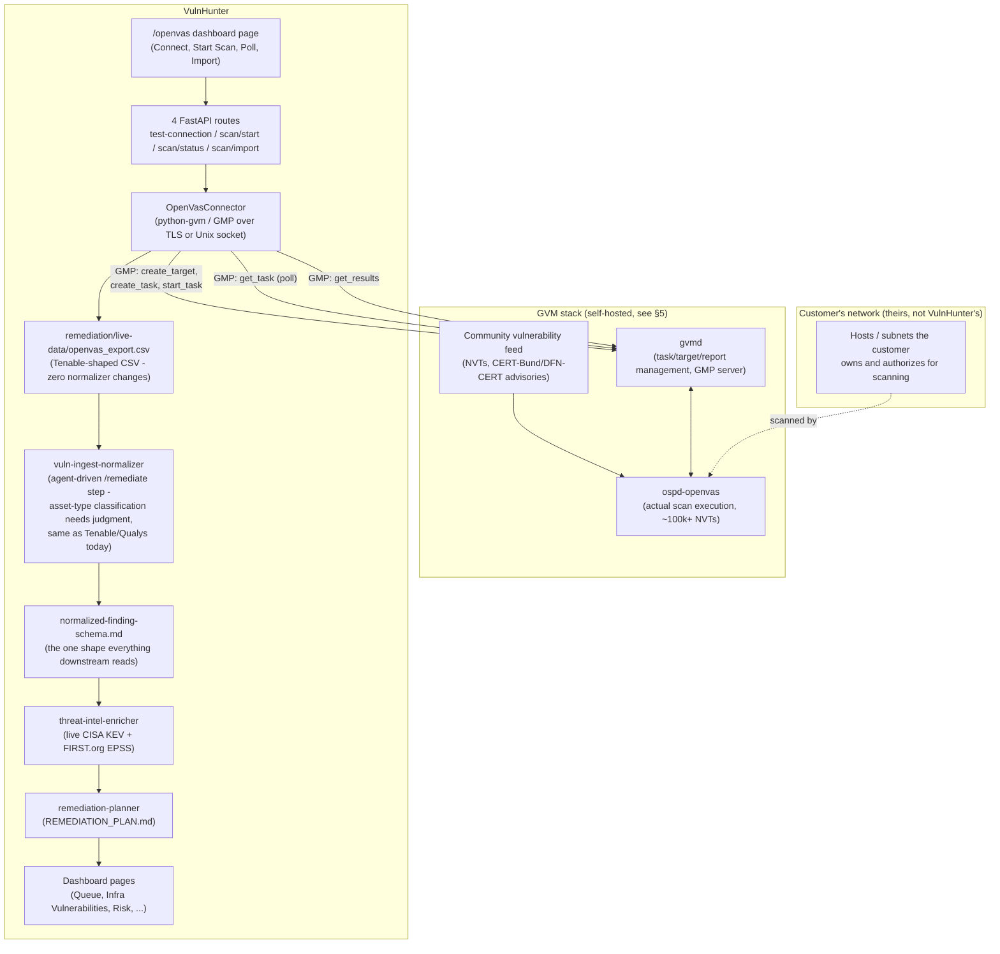

# Turning VulnHunter into a real scanner, not just a workflow

Every connector before this document existed (Tenable, Qualys, Prisma Cloud, Cortex
XSIAM, Infoblox, Axonius, Active Directory) pulls data out of a scanner or CMDB someone
already bought, deployed, and pointed at their network. That's a real, valuable
integration layer - but it assumes the hard part (owning a vulnerability scanner) is
already solved. A small or mid-size company with no security team and no existing
Tenable/Qualys contract gets nothing out of any of them.

This document is the answer to "attach a real scan engine, not just another pull
connector": which open-source engine, why, how it's wired into VulnHunter's existing
pipeline, and what a zero-security-headcount company actually does with it on day one.

## 1. Engine choice

| Engine | License | Scope | Ops burden | Enterprise recognition |
|---|---|---|---|---|
| **OpenVAS / Greenbone (GVM)** | Free/open-source (GPL) | Authenticated + unauthenticated network & host vulnerability scanning, CVE-based, ~100k+ NVT test library | High - multi-container stack (gvmd, ospd-openvas, Postgres, Redis) + a large vulnerability-feed sync | Very high - direct fork lineage of Nessus, the de facto free alternative to Nessus/Qualys for two decades |
| Nessus Essentials | Free tier only (commercial otherwise) | Same category as GVM | Low (single install) | Highest, but not open-source and capped at 16 hosts for free |
| Nuclei (ProjectDiscovery) | Free/open-source | Template-based scanning - fast CVE/misconfig checks against web/network endpoints, not deep authenticated host auditing | Very low - single static binary | High among practitioners, lighter-weight category |
| OWASP ZAP | Free/open-source | Web application DAST (not network/host CVEs) | Low-medium | Very high for web app testing specifically |
| Trivy (Aqua) | Free/open-source | Container images, IaC, SBOM/dependency CVEs | Low | High, but wrong category (not network/host scanning) |
| OSV-Scanner (Google) | Free/open-source | Dependency/SBOM CVEs against OSV.dev | Very low | Growing, also wrong category |

**Decision: OpenVAS / Greenbone Community Edition (GVM) is the primary engine**, because
it is the only entry in this table that is simultaneously (a) genuinely free and open
source, (b) does the same job Tenable/Qualys already do in this codebase (authenticated,
credentialed network and host CVE scanning), and (c) has enough name recognition and
production history that a buyer can trust it the way they'd trust Tenable. Nuclei and
ZAP are real, well-regarded tools, but they answer a different question (fast
external/web checks, not deep authenticated infrastructure scanning) - they're recorded
as a **phase 2, not built** recommendation in §6, the same "don't half-build a second
thing" discipline this project already applies elsewhere (see `docs/INTEGRATIONS.md`'s
`reference`-status entries).

**What's real vs. what requires your own GVM instance** (same honesty convention as
every connector in this repo, see `remediation/connectors/README.md`):
[`remediation/connectors/openvas_connector.py`](../remediation/connectors/openvas_connector.py)
implements the documented GMP protocol via Greenbone's own `python-gvm` library, and is
unit-tested against a mocked GMP client
([`tests/test_openvas_connector.py`](../tests/test_openvas_connector.py)) shaped like
that documentation. It has **not** been exercised against a real GVM server - none was
available while building it. Standing up GVM itself (§5) is infrastructure work outside
this repo; this connector is what talks to it once it exists.

## 2. Architecture



The key design decision: **GVM produces raw results in Tenable's exact CSV column
shape** (`OpenVasConnector.to_csv_row()`, mirroring `qualys_connector.py`), so nothing
downstream of the connector changes. The normalizer, threat-intel enrichment,
remediation planning, and every dashboard page that already understands a "CVE-scoped
host vulnerability" finding work on GVM data with zero modification. This is the same
"normalize once, at the edge" principle `normalized-finding-schema.md` already documents
for Tenable/Armis/manual threat intel - GVM is just a fourth source hitting the same
normalizer, not a parallel pipeline.

### Why a 3-step lifecycle instead of one "Fetch" button

Every existing pull connector (Tenable, Qualys, ...) has one blocking `fetch` action
because the source **already ran its scan** - fetching is just reading data out. GVM is
different: VulnHunter has to *launch* the scan itself, and a real authenticated network
scan can run for minutes to hours depending on scope. Blocking one HTTP request for that
long is the wrong shape (request timeouts, a stuck browser tab, no way to check progress
mid-scan). So the connector and the dashboard page expose three separate, non-blocking
steps instead:

1. **`POST /api/openvas/scan/start`** - creates the GVM target + task, starts it,
   returns immediately with a `task_id`.
2. **`POST /api/openvas/scan/status`** - cheap poll, returns `{status, progress}`.
   Call this as many times as you like while the scan runs.
3. **`POST /api/openvas/scan/import`** - once `status` is `"Done"`, pulls the real
   results and writes the CSV.

All three (plus `test-connection`) require credentials on every call
(`credentialShape: "per-request"`, same as every other pull connector in
`adaptorCatalog.js`) - VulnHunter never stores a GVM password.

## 3. Schema

### 3.1 New: the scan-lifecycle shape (in-memory / request bodies only - not persisted to disk)

VulnHunter does not introduce a database or a new on-disk job store for this. A
`task_id` is GVM's own identifier; VulnHunter is stateless between the three calls above
- the dashboard page holds the connection fields and the current `task_id` in memory for
the duration of one visit, and re-sends them on every call (see `openvas.js`). This
mirrors GMP itself, which is the actual system of record for scan state - VulnHunter has
no reason to duplicate it.

```
ScanTarget (GMP-side, created by create_and_start_scan)
  name        string   e.g. "Corp LAN"
  hosts       string[] e.g. ["10.20.30.0/24", "scanme.example.com"]

ScanJob (GMP-side; VulnHunter only ever holds task_id)
  task_id     string   GVM's task UUID
  status      "Requested" | "Running" | "Done" | "Stopped" | "Interrupted"
  progress    integer  0-100
```

### 3.2 GMP result -> the existing Tenable/Qualys CSV shape -> `normalized-finding-schema.md`

| Tenable CSV column | Source in GMP `<result>` XML |
|---|---|
| `Plugin ID` | `nvt/@oid` |
| `CVE` | `nvt/cve`, falling back to `nvt/refs/ref[@type='cve']/@id` |
| `Risk` | Derived from `severity` using this project's own CVSS bands (`>=9.0` Critical / `>=7.0` High / `>=4.0` Medium / else Low) - **not** GMP's own coarser `<threat>` label, which has no Critical tier |
| `CVSS v3.0 Base Score` | `severity` (GMP reports this as a raw CVSS base score, not a category) |
| `Host` / `FQDN` | `host/hostname` |
| `IP Address` | `host` (element text) |
| `Name` | `name` |
| `Synopsis` | `nvt/tags` `summary=` segment, falling back to `description` |
| `Solution` | `nvt/tags` `solution=` segment |
| `Port` / `Protocol` | `port` (e.g. `"445/tcp"`, split on `/`) |
| `First Discovered` / `Last Observed` | `result/@creation_time` / `@modification_time` |

From there, the row flows through the **existing, unmodified** pipeline documented in
[`normalized-finding-schema.md`](../remediation/schema/normalized-finding-schema.md):
`asset.type` classification -> `remediation_domain` routing -> `kev`/`epss` enrichment ->
`remediation-planner`. A GVM finding looks, to every one of those stages, exactly like a
Tenable finding.

## 4. The zero-knowledge onboarding path

This is the actual product answer to "a small company with no vulnerability-management
experience can get started": what they click, in order, with no prior security
knowledge assumed.

1. Stand up GVM (§5) - the one infrastructure step that can't be skipped; a scan engine
   has to run somewhere.
2. Open **Adaptors -> OpenVAS / Greenbone (GVM)** in VulnHunter.
3. Enter the GVM hostname/username/password, click **Test Connection** - confirms
   credentials work before anything scans.
4. Enter what to scan (their office IP range, or a single server) and check the
   authorization checkbox - VulnHunter refuses to start a scan without it.
5. Click **Start Scan**. Walk away - a full authenticated scan of even a /24 can take
   hours.
6. Come back, click **Check Status** until it reads `Done`.
7. Click **Import Results**.
8. Run `/remediate remediation/live-data/openvas_export.csv` (the same one documented
   step every CVE-scoped connector already requires, see `docs/GOING_LIVE.md`) - this is
   the judgment-based asset-classification step, not a second scan.
9. Reload the dashboard: real findings, already scored against live KEV/EPSS threat
   intel, already prioritized in the remediation queue - the same experience a Tenable
   or Qualys customer gets, built entirely on a free engine they now own outright.

## 5. Standing up GVM itself (reference, not built by this repo)

GVM is real infrastructure that has to run somewhere reachable from both the target
network and VulnHunter - this repo provides the *client*, not a packaged deployment.
Greenbone publishes an official Docker Compose stack
(`greenbone/docker-compose` / the `greenbone-community-edition` scripts, see
https://greenbone.github.io/docs/latest/22.4/container/index.html for the current
version's exact compose file). Practical notes for a first deployment:

- **Resource floor**: Greenbone documents 4+ CPU cores and 4-8GB RAM as a realistic
  minimum for `gvmd`+`ospd-openvas`+Postgres+Redis together, before counting the feed.
- **Feed sync takes real time on first boot** - the community NVT feed is several GB and
  a fresh sync can take hours; a company's very first scan should be scheduled for the
  day after standing up GVM, not the same hour.
- **Network placement matters**: GVM must be positioned so it can actually reach the
  target network (inside the LAN, or over a site-to-site VPN) - scanning through a
  firewall from the outside will silently under-report.
- **Community feed cadence is slower than Greenbone's paid Enterprise feed** - an honest
  trade-off of the free tier, not a bug in this connector.

## 6. Deliberately not built yet (phase 2 candidates)

Following this project's existing discipline of fully building one thing rather than
half-building several (see the AI-vulnerability-taxonomy additions in `CHANGELOG.md` for
precedent): the following were evaluated and are recommended, not implemented.

- **Nuclei** (ProjectDiscovery) - a lightweight, single-binary, template-driven
  complement for fast external-attack-surface checks (exposed panels, known CVE
  templates against web-facing assets) without GVM's heavy ops burden. Good "day one,
  before GVM's feed even finishes syncing" quick win. Would follow the exact same
  CSV-shape pattern as this connector.
- **OWASP ZAP** - web application DAST (SQLi/XSS/auth flaws in a company's own web
  apps), a different finding category (`scan_type_mapping.py`'s `dast`) than anything
  GVM covers.
- **A background job queue for scan orchestration** - today, `scan/start` returns
  immediately and the browser is responsible for polling `scan/status`. A real
  multi-hour scan started from a closed browser tab keeps running on GVM's side (GVM
  owns the task, not VulnHunter), but nothing pings the customer when it finishes.
  Wiring scan completion into the existing `alert_rules.yaml`/email notification system
  (`report_scheduler.py`) would close that gap - deliberately not done here to keep this
  change scoped to the connector + dashboard wiring itself.
